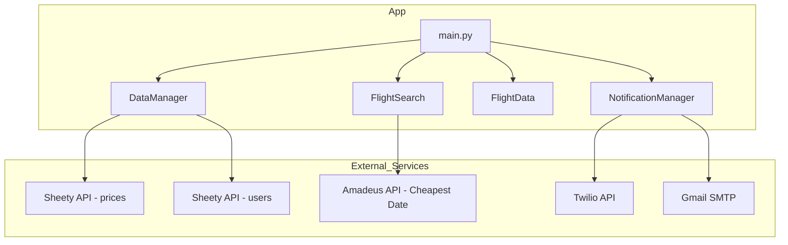

# Day 40 — Capstone: Flight Club – Users & Email Alerts <!-- omit in toc -->
[](../day_40/main.py)  

| **Scope** | **Description**                                                                                                                                                                                                        |
|:---------:|:-----------------------------------------------------------------------------------------------------------------------------------------------------------------------------------------------------------------------|
|   Goal    | Upgrade yesterday's personal flight deal finder into a multi-user "Flight Club" service. Let users sign up with name and email and receive cheap flight alerts automatically.                                          |
|   Steps   | Collect user details (name, email) and store them in a separate users sheet via the Sheety API. Reuse the flight search + price check logic and integrate the SMTP module to email all users when a new deal is found. |
|   Stack   | Python, requests, SMTP, Sheety API, flight search API (Amadeus/Tequila). Use environment variables for API keys and email credentials.                                                                                 |

## 📘 Table of contents <!-- omit in toc -->
- [🧠 Concepts Learned](#-concepts-learned)
- [⚠️ Challenges](#️-challenges)
- [✅ Solutions / Insights](#-solutions--insights)
- [📂 Project Structure](#-project-structure)
- [🏗 Architecture](#-architecture)
- [🎯 Next Steps](#-next-steps)
  - [Content / UX improvements](#content--ux-improvements)
  - [Robustness](#robustness)
  - [Future refactor / practice](#future-refactor--practice)

---

## 🧠 Concepts Learned
- How to **extend a single-user script into a multi-user “service”** using a separate `users` sheet.
- Using a **config module** + `.env` to centralise all credentials and endpoints (Sheety, Amadeus, Twilio, Gmail).
- How to **reuse one computed result** (`best_deal: FlightData`) across multiple notification channels (Twilio + email).
- Implementing **fallback logic**: try direct flights first, then retry with stopovers only if no direct flights are found.
- Representing domain data with a **value object** (`FlightData`) including extra fields like `stops`.
- Deriving booleans from comparisons in a compact way:  
  `non_stop_used = params["nonStop"] == "true"` → then use it for logic.
- Sending bulk emails efficiently by **opening one SMTP connection** and looping through recipients.
- Improving **docstrings** and helper functions to make the flow in `main.py` more readable and “production-like”.

## ⚠️ Challenges
- Dealing with the **Amadeus test environment** returning `500 Internal error` and “system error occurred” even with valid parameters.
- Understanding why some dates caused **“INVALID DATE / date is in past”** errors despite the format being correct.
- Wrapping my head around this pattern:  
  `non_stop_used = params["nonStop"] == "true"` → seeing `=` and `==` on the same line felt confusing at first.
- Making sure I didn’t **call Amadeus twice per destination** (once for Twilio, once for email) and spam the API unnecessarily.
- Wiring together multiple modules (`DataManager`, `FlightSearch`, `NotificationManager`, `FlightData`, `main.py`) without losing track of responsibilities.

## ✅ Solutions / Insights
- Accepted that sometimes **the external API is the problem**, not my code. I handled failures with `ValueError` and skipped bad destinations instead of fighting the sandbox forever.
- Simplified the `stops` logic to something pragmatic for this endpoint:  
  - `nonStop == "true"` → `stops = 0`  
  - `nonStop == "false"` → `stops = 1`  
  Good enough for the course and the available API.
- Refactored `main.py` so that:
  - `find_deals()` is called **once** per row to get `best_deal`,
  - `best_deal` is then reused by:
    - `send_alert_if_deal(best_deal, notifier)` (Twilio)
    - `send_emails_to_users(best_deal, data_manager, notifier)` (SMTP).
- Optimised `send_emails()` to **open one SMTP connection** and send all messages inside a single `with smtplib.SMTP(...)` block.
- Used `DataManager.get_customer_emails()` to cleanly **decouple storage** (Sheety) from notifications, keeping `main.py` simple and readable.
- Got more comfortable reading and writing **clear docstrings** that describe arguments, side effects, and error cases.

## 📂 Project Structure
```
day_40/
├── config.py
├── data_manager.py
├── flight_data.py
├── flight_search.py
├── main.py
├── notification_manager.py
└── test_flight_api.py
```

## 🏗 Architecture


## 🎯 Next Steps
### Content / UX improvements
- Include `stops` info in notifications:
e.g. “direct flight” vs “flight with 1+ stopover”. 
- Improve email subject/body to look more like real product emails.

### Robustness
- Add more explicit handling/logging for Amadeus 500 errors (optional retry / backoff). 
- Handle cases where there are no users gracefully (already partially done with an info print).

### Future refactor / practice
- Come back to Day 19 (turtle race) and refactor it using the cleaner patterns learned up to Day 40 (helpers, separation of concerns, docstrings, etc.).

---
[](day_39.md) [](day_41.md)
