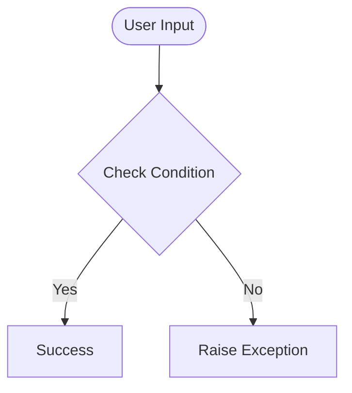

# Day 43 — CSS Selectors for Styled Webpage <!-- omit in toc -->

[](../day_43/main.py)  

| **Scope** | **Description** |
|:---------:|:----------------|
|   Goal    | Learn CSS selectors, link an external stylesheet, and style a multi-section HTML page to practice structure and presentation.          |
|   Steps   | Generate day_43, create index.html and style.css, link the CSS file to the HTML, follow Angela’s lesson to experiment with classes, IDs, and element selectors, then build a simple multi-section webpage (e.g. a mini blog or profile) and open it in the browser to verify everything is styled correctly.         |
|   Stack   | VS Code, HTML, CSS, web browser (Python only for the generator script).         |

## 📘 Table of contents <!-- omit in toc -->

- [🧠 Concepts Learned](#-concepts-learned)
- [⚠️ Challenges](#️-challenges)
- [✅ Solutions / Insights](#-solutions--insights)
- [📂 Project Structure](#-project-structure)
- [🏗 Architecture](#-architecture)
- [🎯 Next Steps](#-next-steps)

---

## 🧠 Concepts Learned

(Write bullet points here)

## ⚠️ Challenges

(What was confusing / hard)

## ✅ Solutions / Insights

(How you solved it / what finally clicked)

## 📂 Project Structure

```text
day_43/
├── main.py
├── config.py
```

## 🏗 Architecture



## 🎯 Next Steps

(Refactors, extra features, things to revisit)  

---
[](day_42.md) [](day_44.md)
