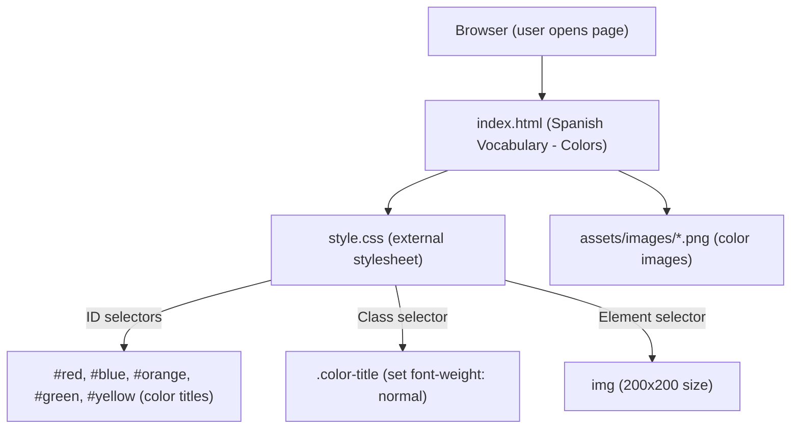

# Day 43 — CSS Selectors for Styled Webpage <!-- omit in toc -->

[](../day_43/main.py)  

| **Scope** | **Description** |
|:---------:|:----------------|
|   Goal    | Learn CSS selectors, link an external stylesheet, and style a multi-section HTML page to practice structure and presentation.          |
|   Steps   | Generate day_43, create index.html and style.css, link the CSS file to the HTML, follow Angela’s lesson to experiment with classes, IDs, and element selectors, then build a simple multi-section webpage (e.g. a mini blog or profile) and open it in the browser to verify everything is styled correctly.         |
|   Stack   | VS Code, HTML, CSS, web browser (Python only for the generator script).         |

## 📘 Table of contents <!-- omit in toc -->

- [🧠 Concepts Learned](#-concepts-learned)
- [⚠️ Challenges](#️-challenges)
- [✅ Solutions / Insights](#-solutions--insights)
- [📂 Project Structure](#-project-structure)
- [🏗 Architecture](#-architecture)
- [🎯 Next Steps](#-next-steps)

---

## 🧠 Concepts Learned

- How to link an **external stylesheet** with `<link rel="stylesheet" href="./style.css" />` instead of using inline or internal styles.
- Using **ID selectors** in CSS (e.g. `#red`, `#blue`, etc.) to target specific elements and match their visual style to their meaning.
- Using **class selectors** (e.g. `.color-title`) to apply shared styling (like `font-weight: normal`) across multiple elements.
- The difference in **responsibility** between classes and IDs:
  - Classes → reusable styling.
  - IDs → unique element identifiers (anchors, JS hooks) even if this small exercise uses them for color styling.
- Basic **CSS specificity**: element selectors < class selectors < ID selectors < inline styles `<style="">` < `!important`.
- How to use CSS to control **image dimensions** (`width` and `height`) without touching the HTML.
- High-level understanding of **modern CSS tooling**:
  - How Tailwind-style utility classes relate to traditional CSS.
  - Philosophical difference between **Bootstrap’s component-first approach** and **Tailwind’s utility-first, design-token approach**.

## ⚠️ Challenges

- Angela’s lesson did not clearly explain **when to use a class vs an ID** in real-world scenarios, which created some conceptual friction.
- Understanding how **CSS specificity** actually works in practice, and why using IDs for styling can become problematic in larger projects.
- Reconciling the “course way” (IDs + classes) with **modern best practices** (classes for styling, IDs mostly for behavior/anchors).
- Feeling that the material is a bit “old-school” (1999 vibes) compared to modern frameworks like Tailwind, while still needing to respect the foundational concepts for muscle memory.

## ✅ Solutions / Insights

- Adopted a clear mental rule:
  - **Classes for styling**, reusable patterns, and shared appearance.
  - **IDs only for unique elements** (anchors, JS hooks, accessibility) in real-world projects.
- Internalized the **specificity hierarchy**:
  - Element < Class < ID < Inline < `!important`, and understood why escalating specificity leads to “CSS wars”.
- Realized that frameworks like **Tailwind** deliberately avoid high specificity by using only **class-based, atomic utilities**, which keeps styles predictable and easy to override.
- Clarified the difference between:
  - **Bootstrap** → pre-styled components (IKEA furniture).
  - **Tailwind** → low-level styling tokens (LEGO bricks).
- Confirmed that the final CSS for the Spanish colors exercise is correct, simple, and aligned with Angela’s expectations, while keeping in mind how senior devs would evolve the approach in bigger projects.

## 📂 Project Structure

```text
day_43
├── 5.1. Adding CSS
│   ├── Solution
│   │   ├── external.html
│   │   ├── inline.html
│   │   ├── internal.html
│   │   ├── solution.html
│   │   └── style.css
│   ├── external.html
│   ├── index.html
│   ├── inline.html
│   ├── internal.html
│   └── style.css
├── 5.3 CSS Selectors
│   ├── goal.png
│   ├── index.html
│   ├── solution
│   │   ├── solution-style.css
│   │   └── solution.html
│   └── style.css
├── 5.4 Color Vocab Project
│   ├── assets
│   │   └── images
│   │       ├── blue.png
│   │       ├── green.png
│   │       ├── orange.png
│   │       ├── red.png
│   │       └── yellow.png
│   ├── goal.png
│   ├── index.html
│   ├── solution
│   │   ├── assets
│   │   │   └── images
│   │   │       ├── blue.png
│   │   │       ├── green.png
│   │   │       ├── orange.png
│   │   │       ├── red.png
│   │   │       └── yellow.png
│   │   ├── solution.html
│   │   └── style.css
│   └── style.css
├── config.py
└── main.py
```

## 🏗 Architecture



## 🎯 Next Steps

- Revisit **CSS specificity** with a few custom examples (e.g. conflicting rules between element, class, and ID) to deepen intuition.
- Do a small practice refactor:
  - Rewrite the color styles using classes only, to align with modern best practices (e.g. `.color-title.red`, `.color-title.blue`, etc.).
- Later (when rested), start exploring:
  - A **Tailwind mini-lesson**: translate a simple layout from classic CSS to Tailwind utilities.
  - How **component-based architecture** (React/Next.js + Tailwind/Shadcn) builds on top of these CSS fundamentals.
- Keep HTML/CSS notes handy for future days when the course moves into **web + Python** integration (Flask / APIs / front-end + back-end thinking).

---
[](day_42.md) [](day_44.md)
