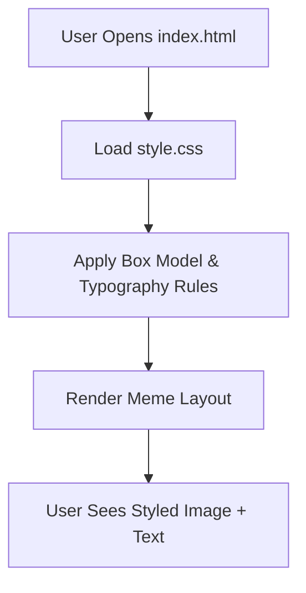

# Day 44 — Advanced HTML & CSS — Divs, Spans, Box Model, Positioning <!-- omit in toc -->

[](../day_44/main.py)  

| **Scope** | **Description** |
|:---------:|:----------------|
|   Goal    | Learn how divs, spans, box model, and CSS positioning work. Build a more structured webpage layout following Angela’s teaching.          |
|   Steps   | Generate day_44 folder, Create index.html, Follow Angela’s tutorial: box model, positioning, divs/spans, Test everything in the browser, Add a notes section in README with diagrams         |
|   Stack   | VS Code, HTML, CSS, web browser         |

## 📘 Table of contents <!-- omit in toc -->

- [🧠 Concepts Learned](#-concepts-learned)
- [⚠️ Challenges](#️-challenges)
- [✅ Solutions / Insights](#-solutions--insights)
- [📂 Project Structure](#-project-structure)
- [🏗 Architecture](#-architecture)
- [🎯 Next Steps](#-next-steps)

---

## 🧠 Concepts Learned

- How HTML **block** elements (`div`) differ from **inline** elements (`span`)
- The full **CSS Box Model** (content → padding → border → margin)
- How total width/height is calculated when padding + borders are added
- Why default paragraph margins matter and how to reset them
- How to center a block using:
  - Manual `width` + `margin-left`
  - Or the more idiomatic `margin: 0 auto;`
- How to style a container as a self-contained component (`.meme`)
- How to import and apply **Google Fonts**
- How to use `text-transform: uppercase` on headings
- The fundamentals of **relative vs absolute positioning** as a way to anchor elements to a reference container

## ⚠️ Challenges

- Understanding why Angela manually adds padding + borders to compute box width  
  (vs the more modern `box-sizing: border-box`)
- CSS nesting confusion (`p` inside `.one {}` looked like SCSS, not CSS)
- Getting the meme layout perfectly centered and aligned
- Deciding when to use classes vs element selectors and avoiding styling all `div`s globally

## ✅ Solutions / Insights

- Corrected the nested CSS selector to valid CSS:  
  ` .one p { margin: 0; } `
- Understood why Angela forces “manual math” in this exercise  
  (to learn the *classic* box model behavior with `content-box`)
- Scoped styles into a `.meme` container and used `text-align: center` there
- Adopted `body { margin: 0; }` to remove default browser spacing
- Used `margin: 4% auto 0;` to horizontally center the main meme block
- Built the meme challenge with clean structure, typography, and proper box model handling

## 📂 Project Structure

```text
day_44
├── 6.0 CSS Colors
│   ├── goal.png
│   └── index.html
├── 6.1 Font Properties
│   ├── font-family.html
│   ├── font-size.html
│   ├── goal.png
│   ├── index.html
│   └── solution.html
├── 6.3 CSS Box Model
│   ├── goal.png
│   ├── index.html
│   └── solution.html
├── 6.4 Motivation Meme Project
│   ├── assets
│   │   └── images
│   │       └── daenerys.jpeg
│   ├── goal.png
│   ├── index.html
│   ├── solution
│   │   ├── assets
│   │   │   └── images
│   │   │       └── daenerys.jpeg
│   │   ├── solution.css
│   │   └── solution.html
│   └── style.css
├── config.py
└── main.py
```

## 🏗 Architecture



## 🎯 Next Steps

- Revisit **relative** vs **absolute** *positioning* with a small badge-over-image example
- Add a `max-width` to `.meme` for better responsiveness on large screens
- Practice building another meme using a different font + palette from ColorHunt
- Move toward Day 45: **CSS cascade**, **specificity**, and **inheritance**
- Keep thinking in terms of “components” with scoped classes to avoid global side effects

---
[](day_43.md) [](day_45.md)
