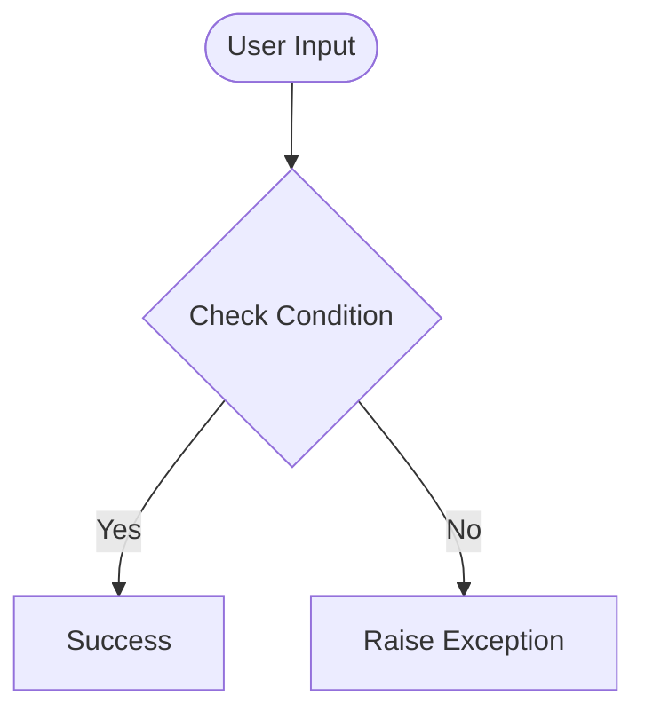

# Day 44 — Advanced HTML & CSS — Divs, Spans, Box Model, Positioning <!-- omit in toc -->

[](../day_44/main.py)  

| **Scope** | **Description** |
|:---------:|:----------------|
|   Goal    | Learn how divs, spans, box model, and CSS positioning work. Build a more structured webpage layout following Angela’s teaching.          |
|   Steps   | Generate day_44 folder, Create index.html, Follow Angela’s tutorial: box model, positioning, divs/spans, Test everything in the browser, Add a notes section in README with diagrams         |
|   Stack   | VS Code, HTML, CSS, web browser         |

## 📘 Table of contents <!-- omit in toc -->

- [🧠 Concepts Learned](#-concepts-learned)
- [⚠️ Challenges](#️-challenges)
- [✅ Solutions / Insights](#-solutions--insights)
- [📂 Project Structure](#-project-structure)
- [🏗 Architecture](#-architecture)
- [🎯 Next Steps](#-next-steps)

---

## 🧠 Concepts Learned

(Write bullet points here)

## ⚠️ Challenges

(What was confusing / hard)

## ✅ Solutions / Insights

(How you solved it / what finally clicked)

## 📂 Project Structure

```text
day_44/
├── main.py
├── config.py
```

## 🏗 Architecture



## 🎯 Next Steps

(Refactors, extra features, things to revisit)  

---
[](day_43.md) [](day_45.md)
