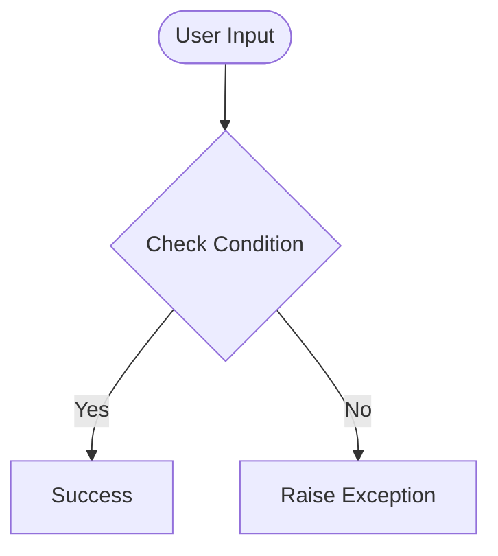

# Day 45 — Web Scraping with BeautifulSoup <!-- omit in toc -->

[](../day_45/main.py)  

| **Scope** | **Description** |
|:---------:|:----------------|
|   Goal    | Learn how to scrape websites without an API using BeautifulSoup. Parse HTML, extract specific elements (movie titles, rankings), and build a custom dataset by navigating and searching through webpage structure.          |
|   Steps   | Generate day_45 folder; create main.py; install BeautifulSoup and requests; follow Angela’s tutorial to load a webpage, inspect HTML structure, parse with BeautifulSoup; practice extracting tags, attributes, and text; scrape Empire's Top 100 Movies list; save results into a Python list or file.         |
|   Stack   | Python, BeautifulSoup, requests, HTML inspection tools (browser DevTools), VS Code         |

## 📘 Table of contents <!-- omit in toc -->

- [🧠 Concepts Learned](#-concepts-learned)
- [⚠️ Challenges](#️-challenges)
- [✅ Solutions / Insights](#-solutions--insights)
- [📂 Project Structure](#-project-structure)
- [🏗 Architecture](#-architecture)
- [🎯 Next Steps](#-next-steps)

---

## 🧠 Concepts Learned

(Write bullet points here)

## ⚠️ Challenges

(What was confusing / hard)

## ✅ Solutions / Insights

(How you solved it / what finally clicked)

## 📂 Project Structure

```text
day_45/
├── main.py
├── config.py
```

## 🏗 Architecture



## 🎯 Next Steps

(Refactors, extra features, things to revisit)  

---
[](day_44.md) [](day_46.md)
