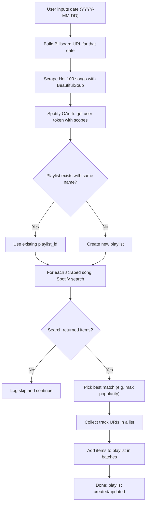

# Day 46 — Spotify Musical Time Machine <!-- omit in toc -->

[](../day_46/main.py)  

| **Scope** | **Description** |
|:---------:|:----------------|
|   Goal    | Build a script that takes a past date, scrapes the Billboard Hot 100 for that day, and creates a Spotify playlist with those songs. Practice combining web scraping (BeautifulSoup) with a real-world API (Spotify).          |
|   Steps   | Steps: Create the day_46 folder, take a date input, scrape Billboard for the Hot 100 titles, and authenticate with Spotify. Search each song, build a playlist with the found tracks, and update your README/log.         |
|   Stack   | Python, requests, BeautifulSoup, Spotify Web API (e.g. spotipy), python-dotenv, VS Code, web browser         |

## 📘 Table of contents <!-- omit in toc -->

- [🧠 Concepts Learned](#-concepts-learned)
- [⚠️ Challenges](#️-challenges)
- [✅ Solutions / Insights](#-solutions--insights)
- [📂 Project Structure](#-project-structure)
- [🏗 Architecture](#-architecture)
- [🎯 Next Steps](#-next-steps)

---

## 🧠 Concepts Learned

- **OAuth flows in practice (Spotify)**
  - Difference between *Client Credentials* (app-only, no user data) vs *Authorization Code* (acts on behalf of the user).
  - Why scopes matter: tokens only allow the actions explicitly granted (e.g., `playlist-modify-private`).
- **Scopes vs endpoints**
  - Search (`/v1/search`) is generally “read-only” and can work with OAuth even with minimal scope.
  - Playlist creation + adding tracks requires `playlist-modify-private` (or public if you want public playlists).
- **Spotify IDs, URIs, and URLs**
  - Track `id` vs `uri` (`spotify:track:...`) vs share URL (`https://open.spotify.com/track/...`).
  - Spotipy functions often accept **a list** of URIs/IDs—*not* one huge comma-separated string.
- **Robust searching**
  - Search queries like `track:{title} artist:{artist}` can return multiple matches.
  - `limit` affects quality—fetch several results and choose the best candidate (e.g., highest `popularity`).
  - Optional narrowing: `market="IT"` (or your country) improves relevance/availability.
- **Pagination basics**
  - Some Spotify endpoints return paginated results (`next` field) and Spotipy can follow pages with `sp.next(results)`.
- **Git hygiene for API projects**
  - Token cache files like `.cache` are sensitive-ish and should be ignored (same as `.env`).
  - If it was already committed once, remove it from tracking and add to `.gitignore`.

## ⚠️ Challenges

- **Auth failure that looked “mysterious” but was simple**
  - `INVALID_CLIENT: Failed to get client` because `client_id` and `client_secret` were swapped in `.env`.
- **Redirect URI confusion**
  - Matching `redirect_uri` in code with the one configured in Spotify Dashboard (`http://127.0.0.1:8888/callback`).
- **Search returning “wrong” tracks**
  - Getting irrelevant results (e.g., low popularity / compilation / weird playlist contexts) until the query was improved.
- **URI formatting for playlist_add_items**
  - Building a massive comma-separated string and getting:
  - `SpotifyException: Unsupported URL / URI.` because Spotipy expected a list of track URIs (or valid inputs), not a single concatenated blob.
- **Safe error handling**
  - A missing search result can cause `IndexError` when doing `items[0]`.
- **Repo issue**
  - `.cache` being tracked caused branch switching/merge pain (`would be overwritten by checkout`).

## ✅ Solutions / Insights

- **Reality-check debugging mindset**
  - Stepped through the auth code and validated env variables early.
  - Found the root cause immediately once the credentials were inspected (ID/secret inverted).
- **OAuth done the “Spotipy way”**
  - Using `SpotifyOAuth(...)` with correct redirect URI and the needed scope(s).
  - Re-auth when changing scopes (because the cached token is tied to scopes).
- **Better search strategy**
  - Use:
    - `sp.search(q=f"track:{title} artist:{artist}", type="track", limit=5, market="IT")`
  - Then select the best candidate (e.g., `max(items, key=lambda t: t["popularity"])`).
- **Correct input type for adding items**
  - Use a **list** of URIs:
    - `track_uris = ["spotify:track:...", "spotify:track:..."]`
  - Then:
    - `sp.playlist_add_items(playlist_id, track_uris)`
- **Graceful failure for missing songs**
  - If no results, skip track and log:
    - “Not able to find an URI for {title} — skipped.”
- **Playlist existence check**
  - Before creating:
    - search user playlists by name → reuse playlist_id if found → otherwise create it.
- **Git fix for `.cache`**
  - Add to `.gitignore` and remove from tracking with the correct path:
    - `git rm --cached day_46/.cache`
  - Commit the removal and push.

## 📂 Project Structure

```text
day_46
├── main.py
├── config.py
```

## 🏗 Architecture



## 🎯 Next Steps

- Refactor `get_spotify_uri()` to be fully safe:
  - return None when not found, and skip appending None in the main loop.
- Improve matching quality:
  - try multiple strategies (title+artist → title only → remove featuring, etc.).
- Add simple batching:
  - Spotify add-items supports chunking (e.g., 50–100 URIs per call).
- Keep repo clean:
  - confirm .env and token cache are ignored in every day folder.

---
[](day_45.md) [](day_47.md)
