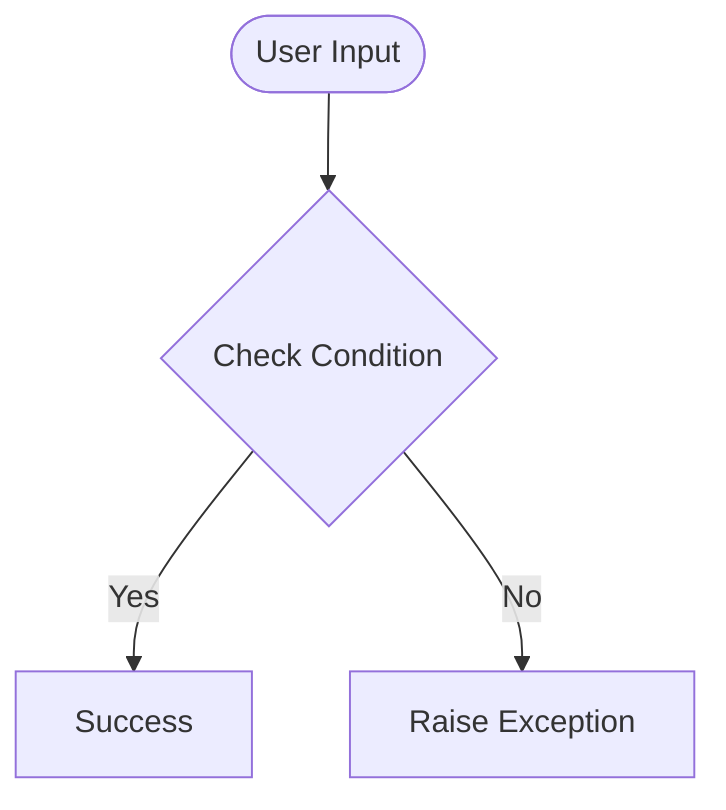

# Day 46 — Spotify Musical Time Machine <!-- omit in toc -->

[](../day_46/main.py)  

| **Scope** | **Description** |
|:---------:|:----------------|
|   Goal    | Build a script that takes a past date, scrapes the Billboard Hot 100 for that day, and creates a Spotify playlist with those songs. Practice combining web scraping (BeautifulSoup) with a real-world API (Spotify).          |
|   Steps   | Steps: Create the day_46 folder, take a date input, scrape Billboard for the Hot 100 titles, and authenticate with Spotify. Search each song, build a playlist with the found tracks, and update your README/log.         |
|   Stack   | Python, requests, BeautifulSoup, Spotify Web API (e.g. spotipy), python-dotenv, VS Code, web browser         |

## 📘 Table of contents <!-- omit in toc -->

- [🧠 Concepts Learned](#-concepts-learned)
- [⚠️ Challenges](#️-challenges)
- [✅ Solutions / Insights](#-solutions--insights)
- [📂 Project Structure](#-project-structure)
- [🏗 Architecture](#-architecture)
- [🎯 Next Steps](#-next-steps)

---

## 🧠 Concepts Learned

(Write bullet points here)

## ⚠️ Challenges

(What was confusing / hard)

## ✅ Solutions / Insights

(How you solved it / what finally clicked)

## 📂 Project Structure

```text
day_46/
├── main.py
├── config.py
```

## 🏗 Architecture



## 🎯 Next Steps

(Refactors, extra features, things to revisit)  

---
[](day_45.md) [](day_47.md)
