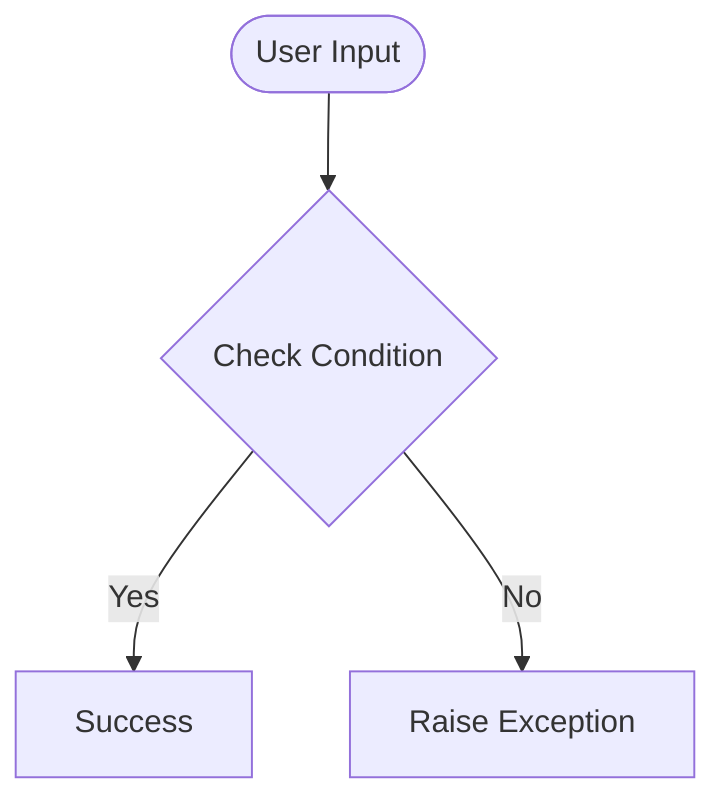

# Day 47 — Amazon Price Tracker <!-- omit in toc -->

[](../day_47/main.py)  

| **Scope** | **Description**                                                                                                                                                                                                 |
|:---------:|:----------------------------------------------------------------------------------------------------------------------------------------------------------------------------------------------------------------|
|   Goal    | Build a Python bot that checks an Amazon product page price and emails you when it drops below a target.                                                                                                        |
|   Steps   | Scaffold day_47 and set up config/.env values (URL, target price, email creds). Scrape the page with requests + BeautifulSoup, parse the price, compare to target, and send an email alert if it’s below.       |
|   Stack   | `Python`, `requests`, `BeautifulSoup`, `smtplib` (+ dotenv optional)                                                                                                                                                                                                                |

## 📘 Table of contents <!-- omit in toc -->

- [🧠 Concepts Learned](#-concepts-learned)
- [⚠️ Challenges](#️-challenges)
- [✅ Solutions / Insights](#-solutions--insights)
- [📂 Project Structure](#-project-structure)
- [🏗 Architecture](#-architecture)
- [🎯 Next Steps](#-next-steps)

---

## 🧠 Concepts Learned

(Write bullet points here)

## ⚠️ Challenges

(What was confusing / hard)

## ✅ Solutions / Insights

(How you solved it / what finally clicked)

## 📂 Project Structure

```text
day_47/
├── main.py
├── config.py
```

## 🏗 Architecture



## 🎯 Next Steps

(Refactors, extra features, things to revisit)  

---
[](day_46.md) [](day_48.md)
