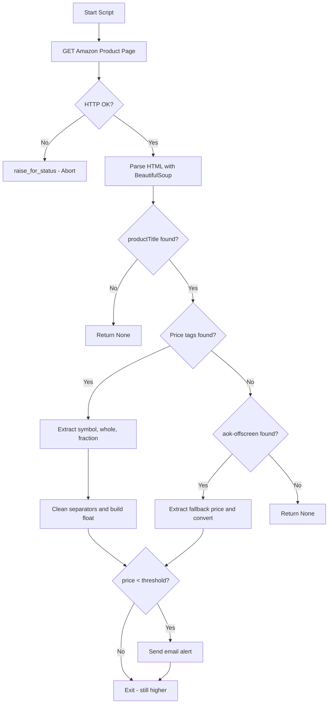

# Day 47 — Amazon Price Tracker <!-- omit in toc -->

[](../day_47/main.py)  

| **Scope** | **Description**                                                                                                                                                                                                 |
|:---------:|:----------------------------------------------------------------------------------------------------------------------------------------------------------------------------------------------------------------|
|   Goal    | Build a Python bot that checks an Amazon product page price and emails you when it drops below a target.                                                                                                        |
|   Steps   | Scaffold day_47 and set up config/.env values (URL, target price, email creds). Scrape the page with requests + BeautifulSoup, parse the price, compare to target, and send an email alert if it’s below.       |
|   Stack   | `Python`, `requests`, `BeautifulSoup`, `smtplib` (+ dotenv optional)                                                                                                                                                                                                                |

## 📘 Table of contents <!-- omit in toc -->

- [🧠 Concepts Learned](#-concepts-learned)
- [⚠️ Challenges](#️-challenges)
- [✅ Solutions / Insights](#-solutions--insights)
- [📂 Project Structure](#-project-structure)
- [🏗 Architecture](#-architecture)
- [🎯 Next Steps](#-next-steps)

---

## 🧠 Concepts Learned

- **Headers matter in web scraping:** adding `User-Agent` and `Accept-Language` can change what HTML you receive (real product page vs bot-check/captcha).
- **`BeautifulSoup.find()` vs `select_one()` behavior:** `find()`/`select_one()` can return `None`, while `find_all()`/`select()` can return `[]`, so you must guard before calling `.get_text()`.
- **Defensive scraping patterns:** check for missing tags (`None`) and handle fallback strategies (e.g., alternate selectors).
- **Converting scraped text into numbers:** scraped prices arrive as strings and often need cleanup before converting to `float`.
- **Email sending with SMTP:** built an alert email that triggers only when a condition is met.
- **Using `EmailMessage` for safer emails:** avoids weird encoding artifacts (like `b'...'`) and handles special characters better.
- **HTTP error handling:** `response.raise_for_status()` helps fail fast when the request doesn’t return a valid page.

## ⚠️ Challenges

- Amazon served a **captcha / “Continue shopping”** page instead of the product page, so the expected price elements “didn’t exist.”
- Price selectors were fragile: sometimes the tag existed in DevTools but not in the HTML returned by `requests`.
- Scraped tags sometimes returned `None` (or empty results), causing crashes when calling `.get_text()` without checks.
- Email body initially showed `b'...'` because the message was converted to bytes with `.encode()`.

## ✅ Solutions / Insights

- Added realistic request headers (`User-Agent`, `Accept-Language`) to receive the correct product page HTML.
- Introduced **guards** for scraping:
  - verify `productTitle` exists before extracting text
  - handle missing price elements by checking tags before calling `.get_text()`
- Implemented a **fallback price strategy**:
  - primary: `a-price-symbol / a-price-whole / a-price-fraction`
  - fallback: `.aok-offscreen` when the primary spans are missing
- Switched from manual string encoding to `EmailMessage()` to avoid the `b'...'` artifact and reduce encoding issues.
- Used `response.raise_for_status()` to avoid parsing broken responses and to surface errors early.

## 📂 Project Structure

```text
day_47/
├── main.py
├── config.py
└── test_amazon_url.py
```

## 🏗 Architecture



## 🎯 Next Steps

- Add a small “bot-check detector” (e.g., if page contains `validateCaptcha` / `opfcaptcha`, exit early with a clear message).
- Refactor into smaller functions: `fetch_page()`, `extract_title()`, `extract_price_primary()`, `extract_price_fallback()`, `send_email()`. 
- Store secrets in `.env` (and commit a `.env.example`) if you haven’t already, keeping credentials out of Git history. 
- Optional: extend the alert message with a timestamp + current price history (store last seen price in a file).

---
[](day_46.md) [](day_48.md)
