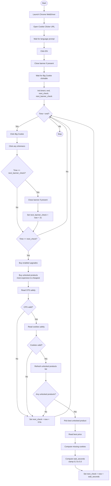

# Day 48 — Selenium WebDriver: Browser Automation & Advanced Web Scraping <!-- omit in toc -->

[](../day_48/main.py)  

| **Scope** | **Description** |
|:---------:|:----------------|
|   Goal    | Learn how Selenium WebDriver automates a real browser to interact with websites (type, click, scroll) beyond what BeautifulSoup can do. Use it to run repeatable “human-like” flows with Python.          |
|   Steps   | Install Selenium and set up a WebDriver (Chrome/Safari) to launch a browser and open pages via Python. Practice locating elements and performing actions like typing, clicking, and scrolling.         |
|   Stack   | `Python`, `Selenium`, `WebDriver` (ChromeDriver/SafariDriver), `VS Code`/`PyCharm`, `Chrome` or `Safari`.         |

## 📘 Table of contents <!-- omit in toc -->

- [🧠 Concepts Learned](#-concepts-learned)
- [⚠️ Challenges](#️-challenges)
- [✅ Solutions / Insights](#-solutions--insights)
- [📂 Project Structure](#-project-structure)
- [🏗 Architecture](#-architecture)
- [🎯 Next Steps](#-next-steps)

---

## 🧠 Concepts Learned

- **Selenium WebDriver basics**: launching Chrome, navigating pages, locating elements, clicking, typing. 
- **Dynamic pages**: why websites can “change under you” (JS re-renders DOM), causing flaky selectors. 
- **Waiting properly**: using `WebDriverWait` + `expected_conditions` instead of guessing with `sleep()`. 
- **Robust automation patterns**:
  - Re-find elements instead of storing them when the DOM updates. 
  - Handle popups/banners that reappear and break flows. 
  - Use retries for unstable reads (`safe_text`) and clicks.
- **Automation logic**: loop that clicks continuously + periodic decision-making (upgrades/products) + adaptive timer based on CPS and prices.

## ⚠️ Challenges

- Consent banner kept reappearing and breaking the run (`ElementNotInteractable`, then `StaleElementReference`). 
- Shimmers occasionally escaped clicking. 
- DOM re-renders caused stale element crashes for products, upgrades, and CPS reads. 
- Parsing “human formatted” numbers like `1.193 million` into real numeric values. 
- Timer logic broke when reads returned empty strings (`IndexError`).

## ✅ Solutions / Insights

- Built a **banner killer** (`close_banner_if_present`) with retry + JS click + periodic checks. 
- Fixed shimmer capture by selecting `.shimmer` and re-checking inside the loop. 
- Eliminated staleness by:
  - Re-finding upgrades each iteration before clicking.
  - Re-finding products by id during purchase loops. 
  - Using `safe_text()` with retries to read CPS/cookies safely.
- Implemented adaptive recheck time:
  - `wait_seconds = (price - cookies_now) / cps` clamped to stay responsive.
- Result: stable automation that hit ~90 CPS in 5 minutes.

## 📂 Project Structure

```text
day_48/
├── config.py
├── cookie_clicker.py
├── interaction.py
└── main.py
```

## 🏗 Architecture



## 🎯 Next Steps

- Day 49: keep the “Angela baseline” + add **one small upgrade** (e.g., lightweight stats logging per check).

Optional side quest: move your helpers (`safe_text`, `close_banner_if_present`, `parse_human_number`) into a tiny `utils.py` for reuse across Selenium scripts. 

---
[](day_47.md) [](day_49.md)
