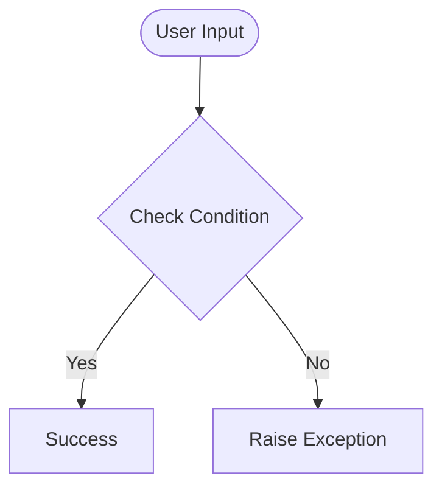

# Day 48 — Selenium WebDriver: Browser Automation & Advanced Web Scraping <!-- omit in toc -->

[](../day_48/main.py)  

| **Scope** | **Description** |
|:---------:|:----------------|
|   Goal    | Learn how Selenium WebDriver automates a real browser to interact with websites (type, click, scroll) beyond what BeautifulSoup can do. Use it to run repeatable “human-like” flows with Python.          |
|   Steps   | Install Selenium and set up a WebDriver (Chrome/Safari) to launch a browser and open pages via Python. Practice locating elements and performing actions like typing, clicking, and scrolling.         |
|   Stack   | `Python`, `Selenium`, `WebDriver` (ChromeDriver/SafariDriver), `VS Code`/`PyCharm`, `Chrome` or `Safari`.         |

## 📘 Table of contents <!-- omit in toc -->

- [🧠 Concepts Learned](#-concepts-learned)
- [⚠️ Challenges](#️-challenges)
- [✅ Solutions / Insights](#-solutions--insights)
- [📂 Project Structure](#-project-structure)
- [🏗 Architecture](#-architecture)
- [🎯 Next Steps](#-next-steps)

---

## 🧠 Concepts Learned

(Write bullet points here)

## ⚠️ Challenges

(What was confusing / hard)

## ✅ Solutions / Insights

(How you solved it / what finally clicked)

## 📂 Project Structure

```text
day_48/
├── main.py
├── config.py
```

## 🏗 Architecture



## 🎯 Next Steps

(Refactors, extra features, things to revisit)  

---
[](day_47.md) [](day_49.md)
