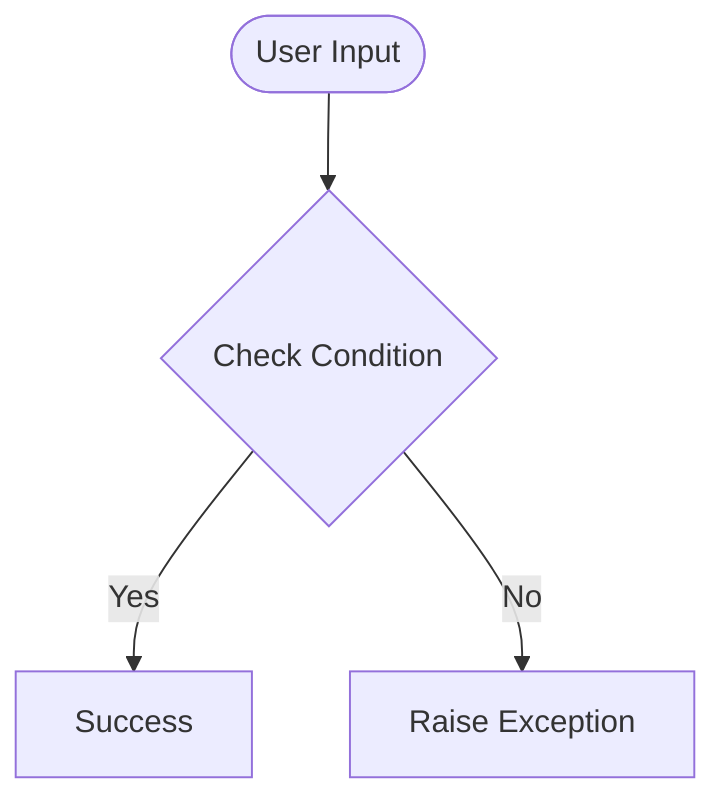

# Day 49 — Automating Gym Class Bookings with Selenium (Snack & Lift) <!-- omit in toc -->

[](../day_49/main.py)  

| **Scope** | **Description** |
|:---------:|:----------------|
|   Goal    | Automate a real browser with Selenium to log in and book gym classes on the Snack & Lift site. Practice reliable element waits, handling dynamic UI states (book/full/waitlist), and building resilient automation.          |
|   Steps   | Set up Selenium with a persistent Chrome profile, automate login, then iterate through class listings to book or join waitlists based on button state. Add retry + validation logic to handle simulated network/time changes and confirm bookings in “My Bookings”.         |
|   Stack   | `Python`, `Selenium WebDriver`, Google Chrome + ChromeDriver (persistent profile), `WebDriverWait`/`Expected Conditions`. Local Snack & Lift practice website (browser storage / `IndexedDB`).         |

## 📘 Table of contents <!-- omit in toc -->

- [🧠 Concepts Learned](#-concepts-learned)
- [⚠️ Challenges](#️-challenges)
- [✅ Solutions / Insights](#-solutions--insights)
- [📂 Project Structure](#-project-structure)
- [🏗 Architecture](#-architecture)
- [🎯 Next Steps](#-next-steps)

---

## 🧠 Concepts Learned

(Write bullet points here)

## ⚠️ Challenges

(What was confusing / hard)

## ✅ Solutions / Insights

(How you solved it / what finally clicked)

## 📂 Project Structure

```text
day_49/
├── main.py
├── config.py
```

## 🏗 Architecture



## 🎯 Next Steps

(Refactors, extra features, things to revisit)  

---
[](day_48.md) [](day_50.md)
