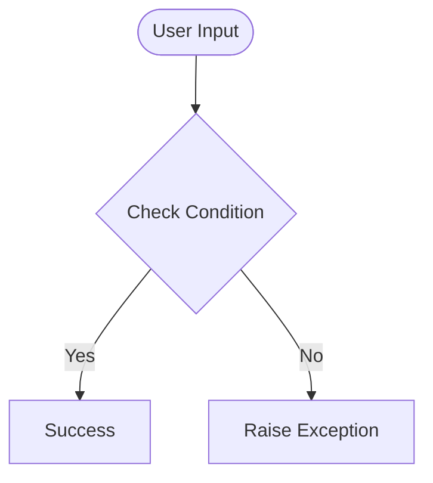

# Day 50 — Day 50 - Auto Tinder Swiping Bot <!-- omit in toc -->

[](../day_50/main.py)  

| **Scope** | **Description** |
|:---------:|:----------------|
|   Goal    | Build a Selenium automation script that logs into Tinder on the web, handles popups/permissions, and performs automated swipes in a controlled loop.          |
|   Steps   | Set up Selenium + WebDriver, automate the login flow, then add reliable waits and popup handling while looping swipes until a limit (time or count) is reached.         |
|   Stack   | `Python`, `Selenium WebDriver`, `Chrome` (or `Safari`) + `WebDriver`/`Selenium Manager`, `VS Code`/`PyCharm`.         |

## 📘 Table of contents <!-- omit in toc -->

- [🧠 Concepts Learned](#-concepts-learned)
- [⚠️ Challenges](#️-challenges)
- [✅ Solutions / Insights](#-solutions--insights)
- [📂 Project Structure](#-project-structure)
- [🏗 Architecture](#-architecture)
- [🎯 Next Steps](#-next-steps)

---

## 🧠 Concepts Learned

(Write bullet points here)

## ⚠️ Challenges

(What was confusing / hard)

## ✅ Solutions / Insights

(How you solved it / what finally clicked)

## 📂 Project Structure

```text
day_50/
├── main.py
├── config.py
```

## 🏗 Architecture



## 🎯 Next Steps

(Refactors, extra features, things to revisit)  

---
[](day_49.md) [](day_51.md)
