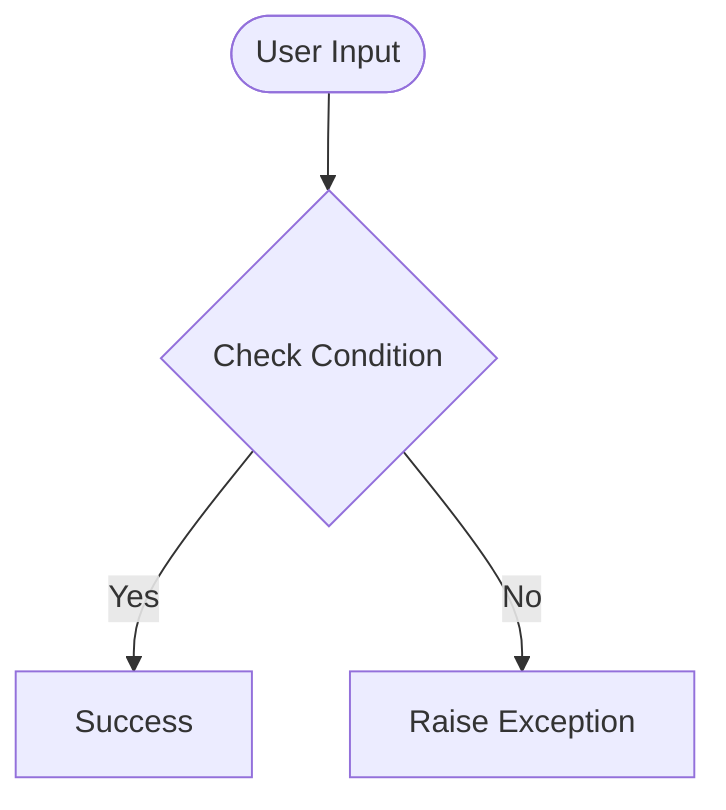

# Day 51 — Internet Speed Twitter Complain Bot <!-- omit in toc -->

[](../day_51/main.py)  

| **Scope** | **Description** |
|:---------:|:----------------|
|   Goal    | Build an automated “Internet Speed Complaint” bot that uses Selenium to run a Speedtest, captures download/upload results, compares them to promised speeds, and posts a complaint tweet when the speed is below the guarantee.          |
|   Steps   | Use Selenium to open speedtest.net, click “Go”, wait for the test to finish, and extract the download/upload values (and result ID if available). If the measured speeds are under the promised thresholds, automate logging into X/Twitter and publish a formatted complaint tweet to the provider’s handle.         |
|   Stack   | `Python`, `Selenium WebDriver` (`Chrome`/`Safari`), `speedtest.net`, X/Twitter web app. Environment variables (`.env`) for credentials and promised speed thresholds.         |

## 📘 Table of contents <!-- omit in toc -->

- [🧠 Concepts Learned](#-concepts-learned)
- [⚠️ Challenges](#️-challenges)
- [✅ Solutions / Insights](#-solutions--insights)
- [📂 Project Structure](#-project-structure)
- [🏗 Architecture](#-architecture)
- [🎯 Next Steps](#-next-steps)

---

## 🧠 Concepts Learned

(Write bullet points here)

## ⚠️ Challenges

(What was confusing / hard)

## ✅ Solutions / Insights

(How you solved it / what finally clicked)

## 📂 Project Structure

```text
day_51/
├── main.py
├── config.py
```

## 🏗 Architecture



## 🎯 Next Steps

(Refactors, extra features, things to revisit)  

---
[](day_50.md) [](day_52.md)
