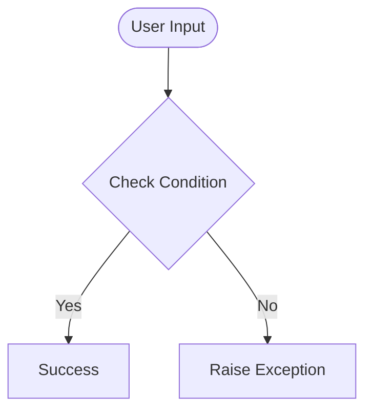

# Day 52 — Instagram Follower Bot <!-- omit in toc -->

[](../day_52/main.py)  

| **Scope** | **Description** |
|:---------:|:----------------|
|   Goal    | Build an Instagram follower bot with Selenium that logs in and follows users from a target account’s follower list. Keep it stable with explicit waits and safe follow limits.          |
|   Steps   | Automate login and handle cookie/“Not now” popups. Open a target profile, load followers by scrolling the modal, and click Follow in a controlled loop.         |
|   Stack   | `Python`, `Selenium WebDriver`, `ChromeDriver` (or `Safari` on macOS). Optional: `python-dotenv` for credentials.         |

## 📘 Table of contents <!-- omit in toc -->

- [🧠 Concepts Learned](#-concepts-learned)
- [⚠️ Challenges](#️-challenges)
- [✅ Solutions / Insights](#-solutions--insights)
- [📂 Project Structure](#-project-structure)
- [🏗 Architecture](#-architecture)
- [🎯 Next Steps](#-next-steps)

---

## 🧠 Concepts Learned

(Write bullet points here)

## ⚠️ Challenges

(What was confusing / hard)

## ✅ Solutions / Insights

(How you solved it / what finally clicked)

## 📂 Project Structure

```text
day_52/
├── main.py
├── config.py
```

## 🏗 Architecture



## 🎯 Next Steps

(Refactors, extra features, things to revisit)  

---
[](day_51.md) [](day_53.md)
