# Day 52 — Instagram Follower Bot <!-- omit in toc -->

[](../day_52/main.py)  

| **Scope** | **Description** |
|:---------:|:----------------|
|   Goal    | Build an Instagram follower bot with Selenium that logs in and follows users from a target account’s follower list. Keep it stable with explicit waits and safe follow limits.          |
|   Steps   | Automate login and handle cookie/“Not now” popups. Open a target profile, load followers by scrolling the modal, and click Follow in a controlled loop.         |
|   Stack   | `Python`, `Selenium WebDriver`, `ChromeDriver` (or `Safari` on macOS). Optional: `python-dotenv` for credentials.         |

## 📘 Table of contents <!-- omit in toc -->

- [🧠 Concepts Learned](#-concepts-learned)
- [⚠️ Challenges](#️-challenges)
- [✅ Solutions / Insights](#-solutions--insights)
- [📂 Project Structure](#-project-structure)
- [🏗 Architecture](#-architecture)
- [🎯 Next Steps](#-next-steps)

---

## 🧠 Concepts Learned

- **UI automation with Selenium**: using `WebDriverWait` + expected conditions to avoid brittle `sleep()`-only scripts.  
- **Modals have their own scroll**: Instagram loads followers lazily inside a popup, so you must scroll the modal element &#40;not the page&#41; with `execute_script()`.  
- **Safer action logic**: only click buttons whose label is exactly `Follow` to avoid triggering the unfollow confirmation popup.  
- **Robust selectors**: prefer stable attributes like `role="dialog"` and `contains(@href, '/followers/')` over absolute XPaths.  
- **Code hygiene**: define instance attributes in `__init__` &#40;e.g., `self.dialog`, `self.scroll_box`&#41; and avoid overly broad `except Exception`.


## ⚠️ Challenges

- Instagram popups are inconsistent &#40;cookies, “Save login info”, “Turn on notifications”&#41; and can block element clicks.  
- The followers list is inside a modal with changing DOM structure, so hardcoded absolute XPaths break easily.  
- Clicking the wrong button state &#40;`Following` / `Requested`&#41; can trigger an unwanted “Unfollow?” modal.

## ✅ Solutions / Insights

- Moved to **explicit waits** for clickability/presence to stabilize interaction timing across runs.  
- Targeted the followers modal via `//div[@role='dialog']` and scrolled the modal using: `scrollTop = scrollHeight` in a loop.  
- Added a **button-state check**: click only when `btn.text == "Follow"` and count skipped buttons for a clean run summary.  
- Fixed PyCharm warnings by defining instance attributes in `__init__` and narrowing exception handling to Selenium exceptions.

## 📂 Project Structure

```text
day_52/
├── config.py
├── instagram_bot.py
└── main.py
```

## 🏗 Architecture

```mermaid
flowchart TD
  A[Start] --> B[Open Instagram login]
  B --> C[Handle cookies &#40;if shown&#41;]
  C --> D[Submit username and password]
  D --> E[Dismiss popups &#40;Not now x2&#41;]
  E --> F[Open target profile]
  F --> G[Open followers modal]
  G --> H[Scroll modal &#40;load more users&#41;]
  H --> I[Loop buttons inside modal]
  I --> J{Button text is Follow?}
  J -->|Yes| K[Click Follow &#40;increment new follows&#41;]
  J -->|No| L[Skip &#40;count already following or requested&#41;]
  K --> M{Reached MAX_FOLLOWS?}
  L --> M
  M -->|No| H
  M -->|Yes| N[Print summary and exit]
```



## 🎯 Next Steps

- Add a `MAX_SCROLLS` limit and a small random delay range to reduce action-block risk.
- Improve counting by avoiding double-counting the same visible “Following” buttons across loops.
- Refactor selectors into constants and add a simple “dry-run” mode that prints how many `Follow` buttons are found without clicking.

---
[](day_51.md) [](day_53.md)
