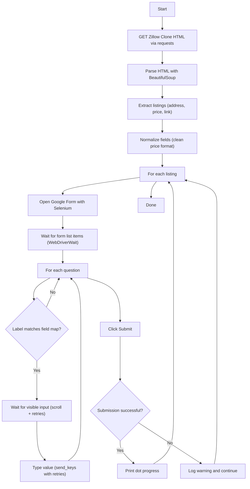

# Day 53 — Data Entry Job Automation <!-- omit in toc -->

[](../day_53/main.py)  

| **Scope** | **Description**                                                                                                                                                                                                                                                     |
|:---------:|:--------------------------------------------------------------------------------------------------------------------------------------------------------------------------------------------------------------------------------------------------------------------|
|   Goal    | Scrape rent listings (price, address, link) from the Zillow Clone and auto-submit each entry into a Google Form to generate a spreadsheet.                                                                                                                          |
|   Steps   | 1. Use requests + BeautifulSoup to extract all listings (price, address, URL).<br/>2. Clean/normalize the scraped text (remove extra symbols, standardize formats).<br/>3. Use Selenium to open the Google Form and submit one response per listing with reliable waits. |
|   Stack   | `Python`, `requests`, `BeautifulSoup4`, `Selenium` + `WebDriver` (`Chrome`), `Google Forms` (+ `Google Sheets` via Responses tab).                                                                                                                                                                                       |

## 📘 Table of contents <!-- omit in toc -->

- [🧠 Concepts Learned](#-concepts-learned)
- [⚠️ Challenges](#️-challenges)
- [✅ Solutions / Insights](#-solutions--insights)
- [📂 Project Structure](#-project-structure)
- [🏗 Architecture](#-architecture)
- [🎯 Next Steps](#-next-steps)

---

## 🧠 Concepts Learned

- **BeautifulSoup scraping pipeline**: request HTML → parse → select the correct container → iterate only direct children (`recursive=False`) to avoid nested `<li>` traps.
- **Data modeling choice matters**: using a `list[dict]` (address/price/link together) reduces index-mismatch bugs vs multiple parallel lists.
- **Cleaning messy scraped strings**: normalizing price strings by extracting the numeric part and rebuilding the required format (e.g., `$2,895`).
- **Selenium timing reality**: elements can exist in the DOM but be **empty / not visible / not interactable** for a moment (especially in Google Forms).
- **Guardrails pattern**: before calling `.text`, `.click()`, `.send_keys()`, always ask: `# What could be None / empty / stale here?`
- **Retries + re-finding elements**: handling `StaleElementReferenceException` and `ElementNotInteractableException` by re-locating the element and trying again.
- **User feedback in CLI**: printing progress dots only on successful submissions gives immediate signal of real progress.


## ⚠️ Challenges

- **Nested `<li>` elements** inside cards caused accidental extra items when using `find_all("li")`.
- `.select_one()` returning `None` and breaking code when chained with `.text.strip()` too early.
- **Price format variance** like `&#36;2,895+/mo` vs `&#36;2,450/mo` needed consistent normalization.
- **Google Forms flakiness**: sometimes the label or first input would render late, leading to missing labels or `ElementNotInteractableException`.
- Retry logic that *looked* correct but accidentally `break`-ed at the wrong time (so it never actually retried typing).

## ✅ Solutions / Insights

- Used `recursive=False` on the result list container to grab only the top-level listing cards.
- Switched to a `list` of `dict` objects per listing to keep address/price/link always aligned.
- Normalized the price with regex extraction of the numeric portion, then rebuilt the string with `&#36;` prefix to match form expectations.
- Made Selenium robust with a consistent pattern:
  - scroll question into view
  - wait for label text (not just element existence)
  - find the first visible, enabled input
  - retry click/clear/send_keys with re-find on stale DOM
- Fixed the “rushing to the end” habit by adding the mental guardrail:
  - `# What could be None / empty / stale here?`

## 📂 Project Structure

```text
day_53/
├── config.py
├── main.py
├── scraper_bot.py
└── test_scraper.py
```

## 🏗 Architecture



## 🎯 Next Steps

- Add a simple **debug mode** flag to print the label text you detect and the key you map it to (super helpful if the form changes).
- Improve reporting: count failures per label (address/price/link) so you can see which field is flaky.
- Optional: reuse a single driver per run to speed up submissions (keep it capstone-simple for now).
- Practice exercise: refactor the scraper to return an Apartment dataclass and compare readability vs dicts.  

---
[](day_52.md) [](day_54.md)
