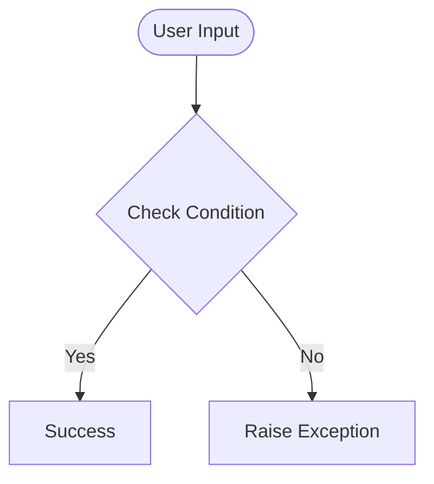

# Day 53 — Data Entry Job Automation <!-- omit in toc -->

[](../day_53/main.py)  

| **Scope** | **Description**                                                                                                                                                                                                                                                     |
|:---------:|:--------------------------------------------------------------------------------------------------------------------------------------------------------------------------------------------------------------------------------------------------------------------|
|   Goal    | Scrape rent listings (price, address, link) from the Zillow Clone and auto-submit each entry into a Google Form to generate a spreadsheet.                                                                                                                          |
|   Steps   | 1. Use requests + BeautifulSoup to extract all listings (price, address, URL).<br/>2. Clean/normalize the scraped text (remove extra symbols, standardize formats).<br/>3. Use Selenium to open the Google Form and submit one response per listing with reliable waits. |
|   Stack   | `Python`, `requests`, `BeautifulSoup4`, `Selenium` + `WebDriver` (`Chrome`), `Google Forms` (+ `Google Sheets` via Responses tab).                                                                                                                                                                                       |

## 📘 Table of contents <!-- omit in toc -->

- [🧠 Concepts Learned](#-concepts-learned)
- [⚠️ Challenges](#️-challenges)
- [✅ Solutions / Insights](#-solutions--insights)
- [📂 Project Structure](#-project-structure)
- [🏗 Architecture](#-architecture)
- [🎯 Next Steps](#-next-steps)

---

## 🧠 Concepts Learned

(Write bullet points here)

## ⚠️ Challenges

(What was confusing / hard)

## ✅ Solutions / Insights

(How you solved it / what finally clicked)

## 📂 Project Structure

```text
day_53/
├── main.py
├── config.py
```

## 🏗 Architecture



## 🎯 Next Steps

(Refactors, extra features, things to revisit)  

---
[](day_52.md) [](day_54.md)
