# Day 54 — Intro to Flask <!-- omit in toc -->

[](../day_54/main.py)  

| **Scope** | **Description** |
|:---------:|:----------------|
|   Goal    | Build my first backend-powered website using Flask and understand the client–server–database model behind modern web apps.          |
|   Steps   | Create day_54 folder + log via generator, install Flask + run a local server, build a minimal Flask app with one route, test it in the browser, and note how requests map to responses.         |
|   Stack   | `Python`, `Flask`, `pip/venv`, `command line`, `VS Code`/`PyCharm`, web browser (`Chrome`/`Safari`)         |

## 📘 Table of contents <!-- omit in toc -->

- [🧠 Concepts Learned](#-concepts-learned)
- [⚠️ Challenges](#️-challenges)
- [✅ Solutions / Insights](#-solutions--insights)
- [📂 Project Structure](#-project-structure)
- [🏗 Architecture](#-architecture)
- [🎯 Next Steps](#-next-steps)

---

## 🧠 Concepts Learned

- **Frontend vs Backend:** HTML/CSS/JS = what the user sees; Flask (Python) = server-side logic that decides what to return.
- **Client–Server–Database model:** browser (client) sends a request, server processes it, database stores/retrieves data when needed.
- **Framework vs Library:** in a framework (Flask), *the framework calls your code* when conditions are met (e.g., a route is requested).
- **Minimal Flask app anatomy:** `app = Flask(__name__)`, routes via `@app.route("/")`, view functions return response content.
- **Routing mental model:** a URL path (like `/`) maps to a Python function that returns the response.
- **Running Flask (modern CLI):** using `flask --app main --debug run` to start the dev server.
- **Environment variables (concept):** used to point Flask to your app entrypoint; modern Flask prefers `--app` over `FLASK_APP=...`.
- **Decorators (core):** functions are first-class objects; decorators wrap functions to add behavior (DRY).
- **Decorator naming conventions (industry standard):** `func` (original), `wrapper` (inner), `result` (returned value).
- **Definition time vs runtime:** `@decorator` runs at definition/import time; the wrapped function runs when the route is hit.

## ⚠️ Challenges

- **Version mismatch anxiety:** Flask 3.x vs Angela’s older 1.x setup created confusion about “the right way” to run the app.
- **PyCharm run configuration friction:** figuring out where to set the Flask app target, debug mode, and why some configs didn’t run.
- **Import path confusion:** `flask --app day_54.main` failed because `day_54` wasn’t a Python package/module from that working directory.
- **Decorator structure clarity:** understanding what the wrapper is doing and what to name things for readability.

## ✅ Solutions / Insights

- **Use the modern Flask CLI:** `flask --app main --debug run` works cleanly with Flask 3.x and avoids older `export FLASK_APP=...` steps.
- **Working directory matters:** when running inside `day_54/`, `--app main` works because `main.py` is importable there.
- **PyCharm Flask server config:** point the Flask app to `main` and set the working directory to `day_54/` so imports resolve properly.
- **Decorators clicked once framed as “registration”:** Flask routes are decorators that *register* functions to run later when requests arrive.
- **Keep decorators transparent:** wrapper calls `func()` and (when relevant) returns the `result` so behavior isn’t accidentally changed.

## 📂 Project Structure

```text
day_54/
├── config.py
└── main.py
```

## 🏗 Architecture

```mermaid
graph TD
    U[Browser &#40;Client&#41;] -->|HTTP Request GET /| S[Flask Dev Server]
    S -->|Route match<br />#40;@app.route#41;| R[View function home<br />#40;func#41;]
    R -->|Return response| S
    S -->|HTTP Response| U
    S -.-> D[(Database<br />#40;future days#41;)]
```



## 🎯 Next Steps

(Refactors, extra features, things to revisit)  

---
[](day_53.md) [](day_55.md)
