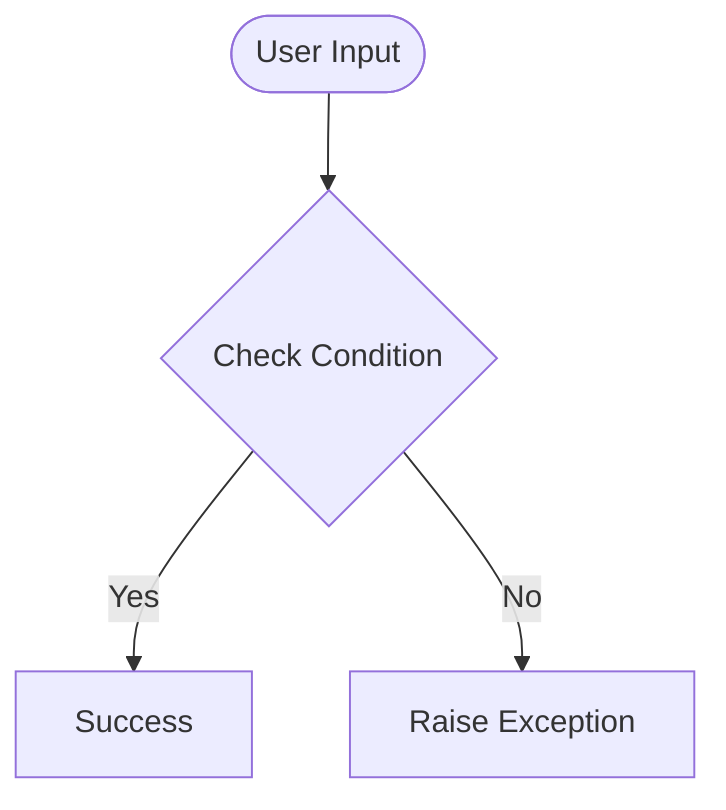

# Day 54 — Intro to Flask <!-- omit in toc -->

[](../day_54/main.py)  

| **Scope** | **Description** |
|:---------:|:----------------|
|   Goal    | Build my first backend-powered website using Flask and understand the client–server–database model behind modern web apps.          |
|   Steps   | Create day_54 folder + log via generator, install Flask + run a local server, build a minimal Flask app with one route, test it in the browser, and note how requests map to responses.         |
|   Stack   | `Python`, `Flask`, `pip/venv`, `command line`, `VS Code`/`PyCharm`, web browser (`Chrome`/`Safari`)         |

## 📘 Table of contents <!-- omit in toc -->

- [🧠 Concepts Learned](#-concepts-learned)
- [⚠️ Challenges](#️-challenges)
- [✅ Solutions / Insights](#-solutions--insights)
- [📂 Project Structure](#-project-structure)
- [🏗 Architecture](#-architecture)
- [🎯 Next Steps](#-next-steps)

---

## 🧠 Concepts Learned

(Write bullet points here)

## ⚠️ Challenges

(What was confusing / hard)

## ✅ Solutions / Insights

(How you solved it / what finally clicked)

## 📂 Project Structure

```text
day_54/
├── main.py
├── config.py
```

## 🏗 Architecture



## 🎯 Next Steps

(Refactors, extra features, things to revisit)  

---
[](day_53.md) [](day_55.md)
