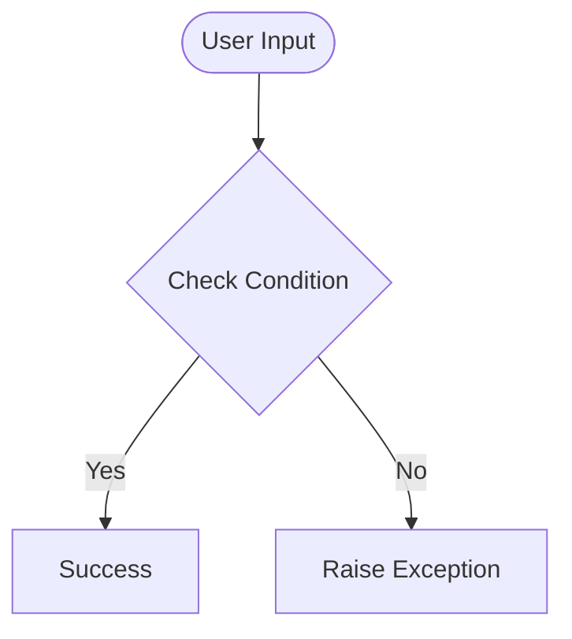

# Day 55 — HTML & URL Parsing in Flask <!-- omit in toc -->

[](../day_55/main.py)  

| **Scope** | **Description** |
|:---------:|:----------------|
|   Goal    | Build a Flask app that renders styled HTML pages and reacts to user guesses passed via the URL.          |
|   Steps   | Create routes for home and dynamic guesses, compare against a random number, and render the correct HTML + GIF response for low/high/correct.         |
|   Stack   | Python, Flask, Jinja2 templates, HTML/CSS, static assets (GIFs).         |

## 📘 Table of contents <!-- omit in toc -->

- [🧠 Concepts Learned](#-concepts-learned)
- [⚠️ Challenges](#️-challenges)
- [✅ Solutions / Insights](#-solutions--insights)
- [📂 Project Structure](#-project-structure)
- [🏗 Architecture](#-architecture)
- [🎯 Next Steps](#-next-steps)

---

## 🧠 Concepts Learned

(Write bullet points here)

## ⚠️ Challenges

(What was confusing / hard)

## ✅ Solutions / Insights

(How you solved it / what finally clicked)

## 📂 Project Structure

```text
day_55/
├── main.py
├── config.py
```

## 🏗 Architecture



## 🎯 Next Steps

(Refactors, extra features, things to revisit)  

---
[](day_54.md) [](day_56.md)
