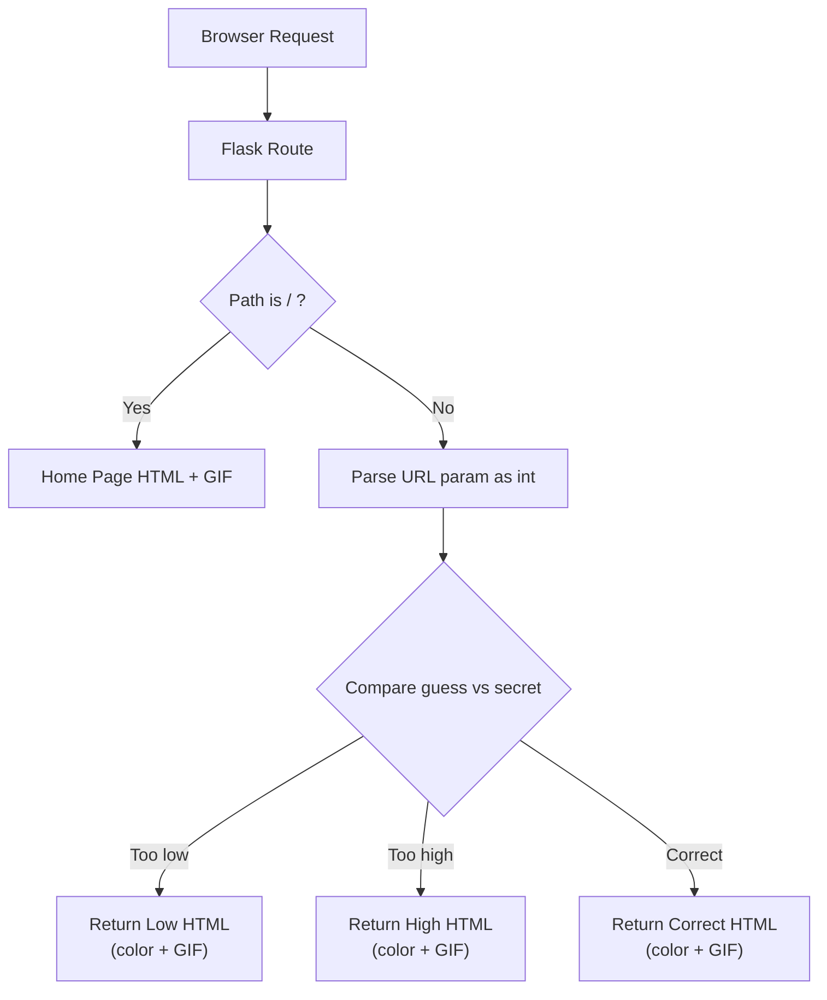

# Day 55 — HTML & URL Parsing in Flask <!-- omit in toc -->

[](../day_55/main.py)  

| **Scope** | **Description** |
|:---------:|:----------------|
|   Goal    | Build a Flask app that renders styled HTML pages and reacts to user guesses passed via the URL.          |
|   Steps   | Create routes for home and dynamic guesses, compare against a random number, and render the correct HTML + GIF response for low/high/correct.         |
|   Stack   | Python, Flask, Jinja2 templates, HTML/CSS, static assets (GIFs).         |

## 📘 Table of contents <!-- omit in toc -->

- [🧠 Concepts Learned](#-concepts-learned)
- [⚠️ Challenges](#️-challenges)
- [✅ Solutions / Insights](#-solutions--insights)
- [📂 Project Structure](#-project-structure)
- [🏗 Architecture](#-architecture)
- [🎯 Next Steps](#-next-steps)

---

## 🧠 Concepts Learned

- Flask routing basics: `@app.route("/")` maps a URL path to a Python function.
- Dynamic URL parsing with converters: `/<int:number>` turns the URL segment into an `int` argument.
- Decorators (and decorator factories): `@decorator` vs `@decorator_factory()` and why `function()()` works.
- Decorator stacking order: bottom decorator wraps first, top wraps last (nested HTML tags).
- Logging decorators: printing function name + args and **still returning** the original result (otherwise `None`).
- Simple “server-side game state”: generating a random number once and comparing user input per request.
- Inline HTML/CSS in Flask responses to style `<h1>` and render GIFs via ``.

## ⚠️ Challenges

- Decorator mental model: understanding that decorating rebinds the function name to the wrapper.
- Confusion around `function()()` syntax (calling a function that returns another function).
- Forgetting to `return result` inside a wrapper → decorated function returns `None`.
- Minor HTML issues (style attribute syntax, broken GIF URL due to duplicated `media/`).
- Dev ergonomics: Starship + PyCharm terminal line-wrapping glitches (known annoyance, not a blocker).

## ✅ Solutions / Insights

- Key rule: **call the decorated function name**; the decorator is applied at definition time.
- `function()()` clicked: first call returns a function; second call invokes the returned function.
- Wrapper must preserve behavior: **print + return** the original output to avoid breaking the function contract.
- Debugged visuals by validating HTML strings and fixing the incorrect GIF URL.
- Kept scope tight: focused on routing + URL params + conditional responses, avoided unnecessary refactors.

## 📂 Project Structure

```text
day_55/
├── main.py
├── config.py
├── decorators.py
└── higher_lower.py
```

## 🏗 Architecture



## 🎯 Next Steps

- Optional polish: include the guessed number in the `<h1>` message using f-strings (without adding extra helper defs).
- Optional: move HTML into templates (`Jinja2`) + `render_template` for cleaner separation (prep for Day 56+).
- Add a “Play again” link on result pages (returns to /).
- Keep practicing: write one more custom decorator (with `*args, **kwargs`) to reinforce the pattern.

---
[](day_54.md) [](day_56.md)
