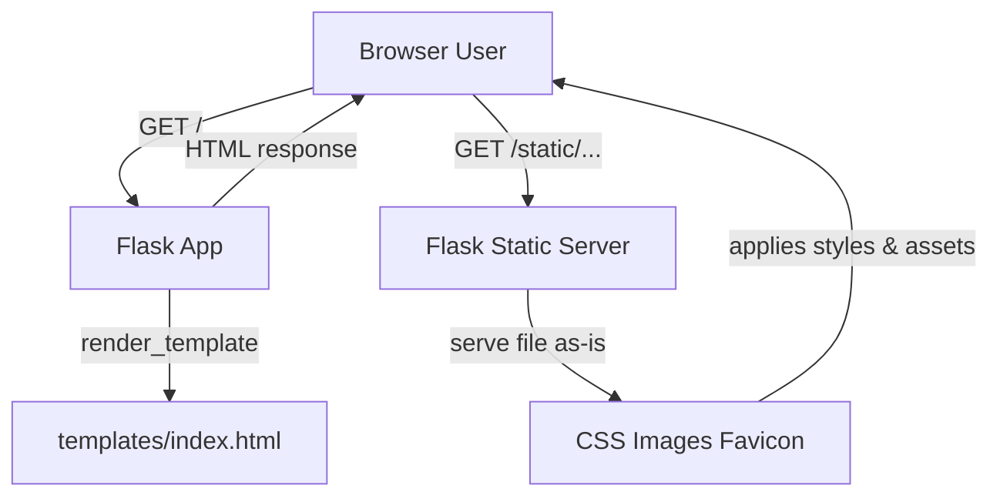

# Day 56 — Flask - Render HTML/Static files & Website Templates <!-- omit in toc -->

[](../day_56/main.py)  

| **Scope** | **Description** |
|:---------:|:----------------|
|   Goal    | Build a Flask website that renders real HTML templates instead of plain text. Learn how to serve and link static assets (CSS + images) to style the pages properly.          |
|   Steps   | Create a Flask app with a `templates/` folder and render pages using `render_template()`. Add a `static/` folder for CSS/images, link them with `url_for('static', filename=...)`, then build the personal name card site.         |
|   Stack   | `Python`,` Flask`, `Jinja2` templates, `HTML`, `CSS`. Static assets via Flask `static/` + `url_for`, running locally with `VS Code`/`PyCharm` and a browser.         |

## 📘 Table of contents <!-- omit in toc -->

- [🧠 Concepts Learned](#-concepts-learned)
- [⚠️ Challenges](#️-challenges)
- [✅ Solutions / Insights](#-solutions--insights)
- [📂 Project Structure](#-project-structure)
- [🏗 Architecture](#-architecture)
- [🎯 Next Steps](#-next-steps)

---

## 🧠 Concepts Learned

- **Templates vs static**: `templates/` holds HTML that Flask *renders* (server-side), while `static/` holds files served “as-is” (CSS, images, JS).
- **Serving HTML with Flask**: using `render_template("index.html")` to return a real page instead of plain text.
- **Static asset URLs**: linking assets with `/static/...` (and the idea that `url_for('static', filename=...)` generates stable links later).
- **Relative vs absolute paths**: why `href="cv/zamir.html"` vs `href="/cv/zamir.html"` behaves differently depending on routes and URL resolution.
- **Browser caching**: static files (CSS/images/favicon) can be cached heavily; hard refresh / “Empty Caches” forces reload.

## ⚠️ Challenges

- **Port conflicts**: hit “Address already in use / Port 5000 in use” when another process was already running.
- **Static paths not loading at first**: needed to refactor template paths from `assets/...` and `images/...` to `/static/assets/...` and `/static/images/...`.
- **IDE warnings**: PyCharm couldn’t always resolve `/static/...` links or Jinja expressions (editor-lint vs runtime reality).
- **Fonts across browsers**: JetBrainsMono Nerd Font worked in Chrome but not consistently in Safari (rendering/fallback differences).
- **CSS “silent failures”**: one tiny syntax error (a trailing comma in `linear-gradient`) broke the whole background styling.
- **Safari being Safari**: favicon loaded at the URL but wouldn’t show until clearing caches.

## ✅ Solutions / Insights

- **Keep Flask dev simple**: run with debug locally and only change host/port when needed; stop other servers using port 5000.
- **Rule of thumb**: templates are *private*, static files are *public* → if the browser must fetch it directly, it belongs in `static/`.
- **Use stable static links**: prefer `/static/...` paths so assets don’t depend on the current route depth; adopt `url_for()` later when routes grow.
- **Debug with the browser, not the IDE**: verify assets by opening them directly (e.g., `/static/...`) and using DevTools network + computed styles.
- **Cache nukes**: hard refresh for CSS changes; Safari “Develop → Empty Caches” solved favicon weirdness immediately.
- **CSS hygiene**: when styling “doesn’t work”, check for syntax errors first—one comma can invalidate an entire declaration.

## 📂 Project Structure

> ✅ **My work:** Flask app wiring + routing + moving template into `templates/` + making all static links work + customizing text/styles.  
> 📦 **Third-party:** HTML/CSS/JS assets from **html5up.net** (imported as a starter template).

```text
day_56/
├── main.py
├── server.py
├── templates/
│   ├── index.html
│   └── cv/
│       └── zamir.html
└── static/
    ├── images/
    │   ├── me.jpg
    │   └── pic01.jpg ... pic12.jpg
    └── assets/
        ├── css/
        │   ├── main.css
        │   ├── noscript.css
        │   └── images/
        │       ├── bg.jpg
        │       └── overlay.png
        ├── js/
        │   ├── main.js
        │   └── (vendor js files…)
        ├── webfonts/
        │   └── (fontawesome files…)
        └── sass/
            └── (source scss files…)
```
> [!NOTE]  
> This project uses a third-party HTML/CSS template from [**html5up.net**](https://html5up.net/astral).
>  
> The value of this exercise is **not** the design itself, but:
> - Integrating an existing frontend template into a Flask backend
> - Refactoring asset paths to work with Flask’s `static/` and `templates/` folders
> - Debugging real-world issues (paths, caching, fonts, CSS syntax)

## 🏗 Architecture



## 🎯 Next Steps

- **Refactor routes**: add a `/cv` Flask route and render `templates/cv/zamir.html` instead of linking directly to the file path.
- **Adopt `url_for()` later**: replace hardcoded `/static/...` and page links with `url_for()` once the app has more routes/pages.
- **Make it reusable**: create a small “template import checklist” (move files, fix paths, clear cache, verify `/static/...` loads).
- **Polish the template**: replace placeholder images, ensure external links (GitHub/LinkedIn) are correct, and keep the attribution footer.
- **Stretch goal**: add a simple contact form page (no database yet) just to practice routing + templates.  

---
[](day_55.md) [](day_57.md)
