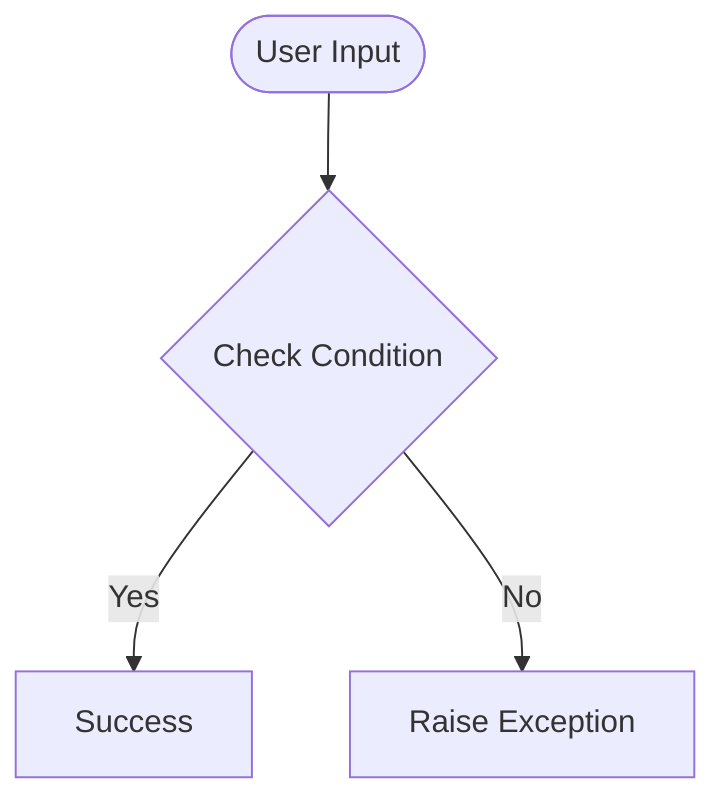

# Day 56 — Flask - Render HTML/Static files & Website Templates <!-- omit in toc -->

[](../day_56/main.py)  

| **Scope** | **Description** |
|:---------:|:----------------|
|   Goal    | Build a Flask website that renders real HTML templates instead of plain text. Learn how to serve and link static assets (CSS + images) to style the pages properly.          |
|   Steps   | Create a Flask app with a `templates/` folder and render pages using `render_template()`. Add a `static/` folder for CSS/images, link them with `url_for('static', filename=...)`, then build the personal name card site.         |
|   Stack   | `Python`,` Flask`, `Jinja2` templates, `HTML`, `CSS`. Static assets via Flask `static/` + `url_for`, running locally with `VS Code`/`PyCharm` and a browser.         |

## 📘 Table of contents <!-- omit in toc -->

- [🧠 Concepts Learned](#-concepts-learned)
- [⚠️ Challenges](#️-challenges)
- [✅ Solutions / Insights](#-solutions--insights)
- [📂 Project Structure](#-project-structure)
- [🏗 Architecture](#-architecture)
- [🎯 Next Steps](#-next-steps)

---

## 🧠 Concepts Learned

(Write bullet points here)

## ⚠️ Challenges

(What was confusing / hard)

## ✅ Solutions / Insights

(How you solved it / what finally clicked)

## 📂 Project Structure

```text
day_56/
├── main.py
├── config.py
```

## 🏗 Architecture



## 🎯 Next Steps

(Refactors, extra features, things to revisit)  

---
[](day_55.md) [](day_57.md)
