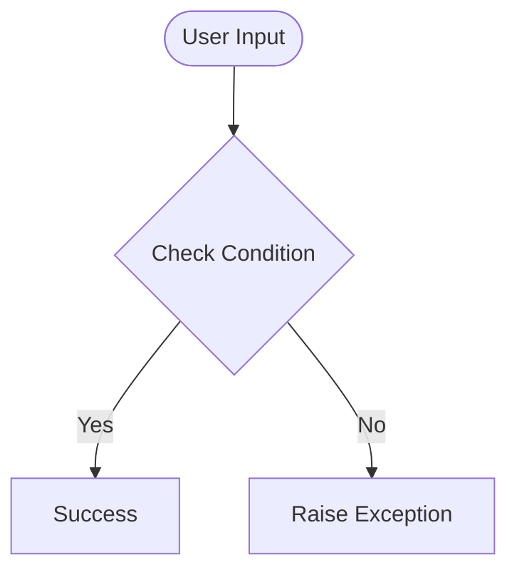

# Day 57 — Templating with Jinja in Flask Apps <!-- omit in toc -->

[](../day_57/main.py)  

| **Scope** | **Description** |
|:---------:|:----------------|
|   Goal    | Learn how to build more advanced Flask apps by using Jinja templating to create reusable page layouts and inject dynamic content. Render different pages (e.g. blog posts) from the same template structure.          |
|   Steps   | Introduce Jinja templates to define a shared layout (structure and styling) and replace specific parts such as title, subtitle, and body with dynamic data. Build a simple blog with multiple posts.         |
|   Stack   | `Python`, `Flask`, `Jinja2` templating, `HTML`/`CSS`, dynamic routing with URLs, browser-based rendering.         |

## 📘 Table of contents <!-- omit in toc -->

- [🧠 Concepts Learned](#-concepts-learned)
- [⚠️ Challenges](#️-challenges)
- [✅ Solutions / Insights](#-solutions--insights)
- [📂 Project Structure](#-project-structure)
- [🏗 Architecture](#-architecture)
- [🎯 Next Steps](#-next-steps)

---

## 🧠 Concepts Learned

(Write bullet points here)

## ⚠️ Challenges

(What was confusing / hard)

## ✅ Solutions / Insights

(How you solved it / what finally clicked)

## 📂 Project Structure

```text
day_57/
├── main.py
├── config.py
```

## 🏗 Architecture



## 🎯 Next Steps

(Refactors, extra features, things to revisit)  

---
[](day_56.md) [](day_58.md)
