# Day 57 — Templating with Jinja in Flask Apps <!-- omit in toc -->

[](../day_57/main.py)  

| **Scope** | **Description** |
|:---------:|:----------------|
|   Goal    | Learn how to build more advanced Flask apps by using Jinja templating to create reusable page layouts and inject dynamic content. Render different pages (e.g. blog posts) from the same template structure.          |
|   Steps   | Introduce Jinja templates to define a shared layout (structure and styling) and replace specific parts such as title, subtitle, and body with dynamic data. Build a simple blog with multiple posts.         |
|   Stack   | `Python`, `Flask`, `Jinja2` templating, `HTML`/`CSS`, dynamic routing with URLs, browser-based rendering.         |

## 📘 Table of contents <!-- omit in toc -->

- [🧠 Concepts Learned](#-concepts-learned)
- [⚠️ Challenges](#️-challenges)
- [✅ Solutions / Insights](#-solutions--insights)
- [📂 Project Structure](#-project-structure)
- [🏗 Architecture](#-architecture)
- [🎯 Next Steps](#-next-steps)

---

## 🧠 Concepts Learned

- **Jinja is built into Flask** and acts as the templating engine that turns Python data into HTML.
- **Template inheritance & reuse**: the same HTML structure can render different content using loops and variables.
- **Jinja syntax vs Python syntax**: `{{ }}` for expressions, `` for control flow.
- **Dynamic URL building with `url_for`** keeps templates decoupled from route paths.
- **Dynamic routes** (`/post/<int:post_id>`) allow one endpoint to serve many pages.
- **Separation of concerns**: routes handle HTTP, a class handles data logic, templates handle presentation.
- **Fail-fast data access**: using bracket notation (`post['title']`) surfaces data-shape bugs early.

## ⚠️ Challenges

- Mixing Python and Jinja mental models (especially `.get()` vs `[...]`).
- Debugging silent template failures caused by unsaved files or incorrect Jinja syntax.
- Structuring data access so rendering a single post didn’t require looping every time.
- Avoiding spaghetti code while the project started to grow beyond a single script.
- Managing a large number of file moves and static assets without breaking paths.

## ✅ Solutions / Insights

- Indexed blog posts by `id` instead of searching lists repeatedly.
- Centralized post logic in a dedicated `Post` class instead of bloating route functions.
- Used `url_for()` everywhere to avoid hardcoded links and future refactors.
- Embraced explicit errors (404, KeyError-style access) to surface bugs early during development.
- Learned to rely on Git as a recovery and safety mechanism when refactoring aggressively.


## 📂 Project Structure

```text
day_57/
├── config.py
├── main.py
├── post.py
├── static/
│   └── css/
│       └── styles.css
└── templates/
    ├── index.html
    ├── post.html
    └── old/
        ├── blog.html
        ├── guess.html
        └── index.html
```

## 🏗 Architecture

```mermaid
graph TD;
    U[Browser] -->|GET /| R1[home route];
    U -->|GET /post/&lt;id&gt;| R2[post route];

    R1 -->|calls| P1[Post.all_posts&#40;&#41;];
    R2 -->|calls| P2[Post.by_id&#40;id&#41;];

    P1 --> API[n:point JSON];
    P2 --> IDX[In-memory index];

    R1 --> T1[index.html];
    R2 --> T2[post.html];

    T1 -->|url_for| R2;
    R2 -->|missing id| E[404];
```



## 🎯 Next Steps

- Add lightweight validation of post schema inside Post to guarantee template safety.

---
[](day_56.md) [](day_58.md)
