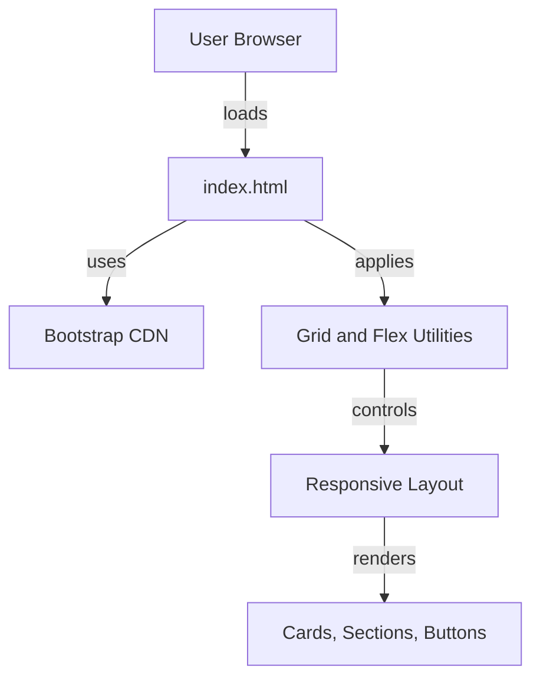

# Day 58 — Bootstrap Setup <!-- omit in toc -->

[](../day_58/main.py)

| **Scope** | **Description** |
|:---------:|:----------------|
|   Goal    | Style my Flask blog using Bootstrap to achieve a clean, responsive layout with reusable templates (base.html) and consistent UI components.           |
|   Steps   | Add Bootstrap via CDN, create base.html with shared head/nav/footer, refactor index.html and post.html to extend base.html, apply Bootstrap containers/cards/typography utilities, test responsiveness (mobile + desktop) and fix spacing/layout issues.         |
|   Stack   | Python, Flask, Jinja2, HTML, CSS, Bootstrap 5 (CDN)         |

## 📘 Table of contents <!-- omit in toc -->

- [🧠 Concepts Learned](#-concepts-learned)
- [⚠️ Challenges](#️-challenges)
- [✅ Solutions / Insights](#-solutions--insights)
- [📂 Project Structure](#-project-structure)
- [🏗 Architecture](#-architecture)
- [🎯 Next Steps](#-next-steps)

---

## 🧠 Concepts Learned

- Bootstrap grid system in depth (`container`, `row`, `col-*`, `row-cols-*`)
- How Bootstrap uses **flexbox internally** and when explicit `d-flex` is required
- Difference between:
  - `text-center` (inline content alignment)
  - `justify-content-*` and `align-items-*` (flex-only utilities)
- How to create **equal-height cards** using `h-100` and flexbox
- Using `d-flex flex-column` + `mt-auto` to pin buttons to the bottom of cards
- Understanding why Bootstrap components sometimes appear “misaligned” when a parent container controls alignment
- Button variants and contrast logic (`btn-outline-light` vs `btn-outline-dark`)
- Why Bootstrap examples can silently break when **CSS and JS versions don’t match**
- Practical debugging using DevTools instead of guessing
- Semantic HTML structure with `<section>`, `<footer>`, headings, and lists

## ⚠️ Challenges

- Cards in the pricing section had **different heights**, breaking visual consistency
- One button appeared “invisible” due to incorrect color variant
- Images/logos aligned to the left instead of being centered
- Confusion about why Angela’s layout “just worked” while mine didn’t
- Bootstrap utilities (`align-items-center`) not working when applied to non-flex elements
- Accidental use of an older Bootstrap CSS version, causing missing styles
- Understanding when alignment is inherited from a parent vs applied locally

## ✅ Solutions / Insights

- Used `h-100` on `.card` elements to force equal height across columns
- Applied `d-flex flex-column` to `.card-body` and `mt-auto` to buttons to align them consistently
- Fixed invisible button by switching from `btn-outline-light` to `btn-outline-dark` on white backgrounds
- Identified that Angela’s centering worked because of a **parent container with `text-center`**
- Learned that `align-items-*` utilities require `d-flex` to function
- Aligned Bootstrap CSS and JS to the same version (5.3.x), restoring gradients and utilities
- Compared layouts structurally instead of visually to understand real differences
- Avoided hacks (fixed heights, empty divs, extra margins) in favor of correct layout logic

## 📂 Project Structure

```text
day_58/
├── MoveItProject
│   ├── box-seam.svg
│   ├── briefcase.svg
│   ├── bus-front.svg
│   ├── chat-square-heart.svg
│   ├── chevron-right.svg
│   ├── couple.jpg
│   ├── dog.jpg
│   ├── family.jpg
│   ├── flower.jpg
│   ├── goal.png
│   ├── index.html
│   ├── moving-van.jpg
│   └── website-text.txt
├── TinDog
│   ├── README.md
│   ├── css
│   │   └── style.css
│   ├── goal images
│   │   ├── features-goal.jpg
│   │   ├── footer-goal.jpg
│   │   ├── pricing-goal.jpg
│   │   ├── testimonial-goal.jpg
│   │   └── title-goal.jpg
│   ├── images
│   │   ├── bizinsider.png
│   │   ├── dog-img.jpg
│   │   ├── iphone.png
│   │   ├── mashable.png
│   │   ├── techcrunch.png
│   │   └── tnw.png
│   └── index.html
├── config.py
└── main.py
```

## 🏗 Architecture



## 🎯 Next Steps

- Move forward to Day 59 with confidence in Bootstrap layouts
- Practice rebuilding one section (e.g. Pricing) from scratch without reference
- Revisit Bootstrap utilities to reduce custom CSS even further
- Start mentally mapping Bootstrap layouts to future Flask templates (`base.html`, `blocks`)

---
[](day_57.md) [](day_59.md)
