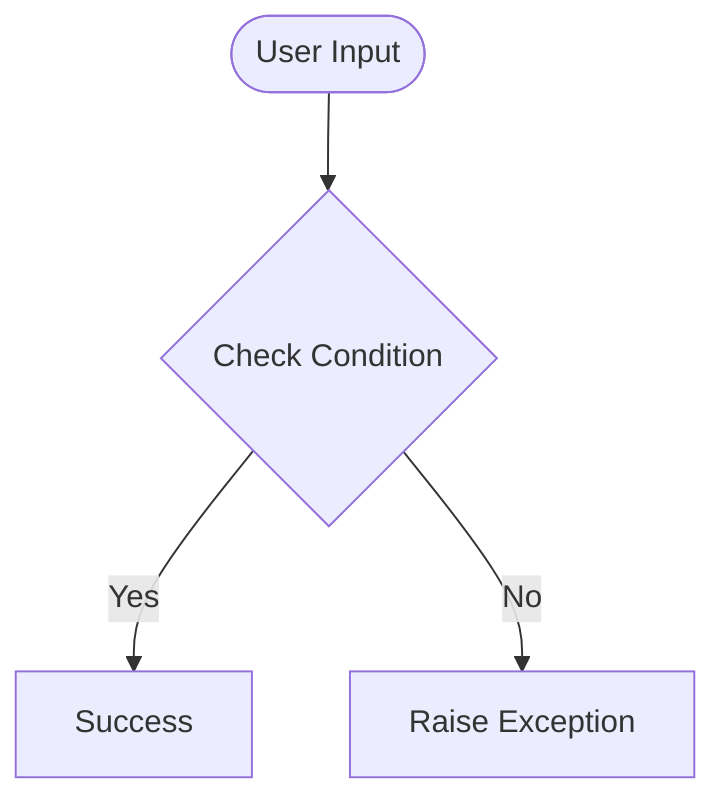

# Day 58 — Bootstrap Setup <!-- omit in toc -->

[](../day_58/main.py)  

| **Scope** | **Description** |
|:---------:|:----------------|
|   Goal    | Style my Flask blog using Bootstrap to achieve a clean, responsive layout with reusable templates (base.html) and consistent UI components.          |
|   Steps   | Add Bootstrap via CDN, create base.html with shared head/nav/footer, refactor index.html and post.html to extend base.html, apply Bootstrap containers/cards/typography utilities, test responsiveness (mobile + desktop) and fix spacing/layout issues.         |
|   Stack   | Python, Flask, Jinja2, HTML, CSS, Bootstrap 5 (CDN)         |

## 📘 Table of contents <!-- omit in toc -->

- [🧠 Concepts Learned](#-concepts-learned)
- [⚠️ Challenges](#️-challenges)
- [✅ Solutions / Insights](#-solutions--insights)
- [📂 Project Structure](#-project-structure)
- [🏗 Architecture](#-architecture)
- [🎯 Next Steps](#-next-steps)

---

## 🧠 Concepts Learned

(Write bullet points here)

## ⚠️ Challenges

(What was confusing / hard)

## ✅ Solutions / Insights

(How you solved it / what finally clicked)

## 📂 Project Structure

```text
day_58/
├── main.py
├── config.py
```

## 🏗 Architecture



## 🎯 Next Steps

(Refactors, extra features, things to revisit)  

---
[](day_57.md) [](day_59.md)
