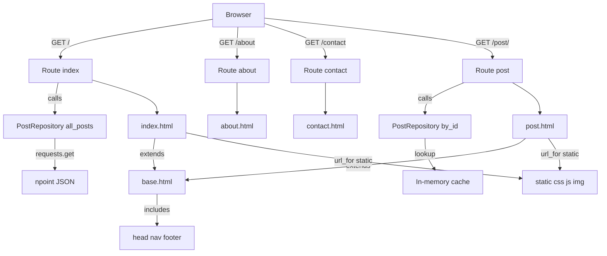

# Day 59 — Bootstrap + Flask blog <!-- omit in toc -->

[](../day_59/main.py)

| **Scope** | **Description**                                                                                                                                                                                                                    |
| :-------: | :--------------------------------------------------------------------------------------------------------------------------------------------------------------------------------------------------------------------------------- |
|   Goal    | Upgrade my Flask blog using a free Bootstrap template to make it multi-page, mobile-responsive, and able to render dynamic post pages with full-screen titles.                                                                     |
|   Steps   | Choose a Bootstrap template → split into /templates + /static → create routes (Home/About/Contact/Post) → render posts dynamically with Jinja → fix asset paths with url_for('static', ...) → test navbar + mobile responsiveness. |
|   Stack   | Python, Flask, Jinja2, Bootstrap 5, HTML/CSS, JavaScript, VS Code/PyCharm.                                                                                                                                                         |

## 📘 Table of contents <!-- omit in toc -->

- [🧠 Concepts Learned](#-concepts-learned)
- [⚠️ Challenges](#️-challenges)
- [✅ Solutions / Insights](#-solutions--insights)
- [📂 Project Structure](#-project-structure)
- [🏗 Architecture](#-architecture)
- [🎯 Next Steps](#-next-steps)

---

## 🧠 Concepts Learned

- Flask template layout patterns: `base.html` + `` + `` for page-specific content.
- Reusable partials with `` for shared UI like `nav.html`, `head.html`, and `footer.html`.
- `url_for()` builds URLs for Flask endpoints and static assets; it expects the _route function name_, not the template file name.
- Dynamic routing with path parameters: `/post/<int:post_id>` and why `url_for('post', post_id=...)` is required.
- Jinja renders server-side before the browser sees HTML; HTML comments do not stop Jinja, but `{# ... #}` does.
- Browser caching basics: `304 Not Modified` means assets are reused from cache and is normal.
- Separation of concerns: moving post fetching/caching into a repository class keeps routes and templates cleaner.

## ⚠️ Challenges

- Confusion between `url_for()` endpoint names vs template filenames caused `BuildError`.
- Jinja inside an HTML comment still executed and crashed template rendering.
- VS Code/linters showed warnings when Jinja was embedded inside CSS-like contexts (e.g., `background-image: url('{{ ... }}')`).
- Prettier/formatters auto-reformatted Jinja braces in templates, creating messy diffs.
- Static asset paths initially broke after moving the Bootstrap template into `/static` and `/templates`.

## ✅ Solutions / Insights

- Treat `url_for()` like calling a Python function: pass the endpoint name (route function) and required parameters.
- Use Jinja comments `{# ... #}` to disable template code safely; HTML comments are not enough.
- Accept editor warnings when templates render correctly, or use `<!-- prettier-ignore -->` / Prettier ignore blocks for Jinja-heavy lines.
- Use hard refresh (Cmd+Shift+R) when CSS/JS changes don’t appear due to cache.
- Keep shared layout in `base.html`, shared UI in includes, and page content in blocks.
- Build a simple `PostRepository` + `Post` object so templates can access `post.title`, `post.date`, etc.

## 📂 Project Structure

```text
day_59/
├── __pycache__
│   ├── config.cpython-313.pyc
│   └── posts.cpython-313.pyc
├── config.py
├── main.py
├── posts.py
├── static
│   ├── assets
│   │   ├── favicon.ico
│   │   └── img
│   │       ├── about-bg.jpg
│   │       ├── contact-bg.jpg
│   │       ├── home-bg.jpg
│   │       ├── post-bg.jpg
│   │       └── post-sample-image.jpg
│   ├── css
│   │   └── styles.css
│   └── js
│       └── scripts.js
└── templates
    ├── about.html
    ├── base.html
    ├── contact.html
    ├── footer.html
    ├── head.html
    ├── index.html
    ├── nav.html
    └── post.html
```

## 🏗 Architecture



## 🎯 Next Steps

- Replace hard-coded sample content with real post data everywhere (title, subtitle, date, author) using the repository.
- Add a clean 404 page template and render it for missing posts.
- Revisit the "background-image" lint warning later and decide whether to keep inline style or move to a cleaner pattern.
- Add basic input validation and error handling for the post data (missing keys, unexpected JSON shape).
- Optional stretch: add pagination or show only the latest N posts.

---

[](day_58.md) [](day_60.md)
