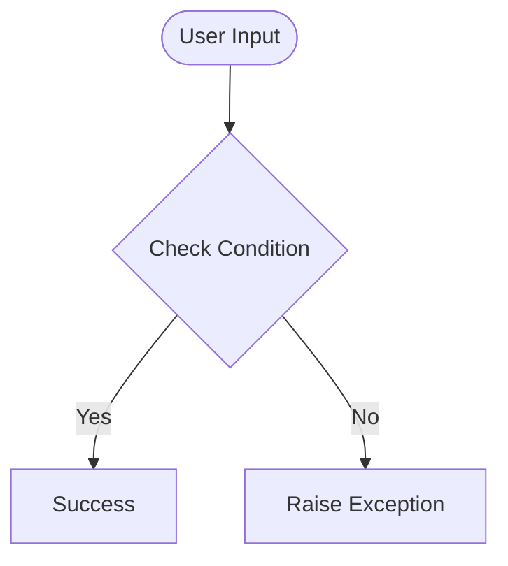

# Day 59 — Bootstrap + Flask blog <!-- omit in toc -->

[](../day_59/main.py)  

| **Scope** | **Description** |
|:---------:|:----------------|
|   Goal    | Upgrade my Flask blog using a free Bootstrap template to make it multi-page, mobile-responsive, and able to render dynamic post pages with full-screen titles.          |
|   Steps   | Choose a Bootstrap template → split into /templates + /static → create routes (Home/About/Contact/Post) → render posts dynamically with Jinja → fix asset paths with url_for('static', ...) → test navbar + mobile responsiveness.         |
|   Stack   | Python, Flask, Jinja2, Bootstrap 5, HTML/CSS, JavaScript, VS Code/PyCharm.         |

## 📘 Table of contents <!-- omit in toc -->

- [🧠 Concepts Learned](#-concepts-learned)
- [⚠️ Challenges](#️-challenges)
- [✅ Solutions / Insights](#-solutions--insights)
- [📂 Project Structure](#-project-structure)
- [🏗 Architecture](#-architecture)
- [🎯 Next Steps](#-next-steps)

---

## 🧠 Concepts Learned

(Write bullet points here)

## ⚠️ Challenges

(What was confusing / hard)

## ✅ Solutions / Insights

(How you solved it / what finally clicked)

## 📂 Project Structure

```text
day_59/
├── main.py
├── config.py
```

## 🏗 Architecture



## 🎯 Next Steps

(Refactors, extra features, things to revisit)  

---
[](day_58.md) [](day_60.md)
