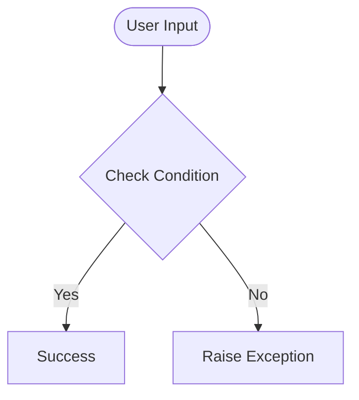

# Day 60 — Bootstrap + Flask POST Form <!-- omit in toc -->

[](../day_60/main.py)  

| **Scope** | **Description** |
|:---------:|:----------------|
|   Goal    | Reuse the Day 59 Flask + Bootstrap blog and add HTML forms with POST handling to collect user input and respond dynamically.          |
|   Steps   | Copy day_59 → day_60, add a form page in templates, create a route with GET/POST, read submitted data via request.form, validate basic inputs, render a success/error response.         |
|   Stack   | Python, Flask, Jinja2, HTML forms, Bootstrap, HTTP GET/POST.         |

## 📘 Table of contents <!-- omit in toc -->

- [🧠 Concepts Learned](#-concepts-learned)
- [⚠️ Challenges](#️-challenges)
- [✅ Solutions / Insights](#-solutions--insights)
- [📂 Project Structure](#-project-structure)
- [🏗 Architecture](#-architecture)
- [🎯 Next Steps](#-next-steps)

---

## 🧠 Concepts Learned

(Write bullet points here)

## ⚠️ Challenges

(What was confusing / hard)

## ✅ Solutions / Insights

(How you solved it / what finally clicked)

## 📂 Project Structure

```text
day_60/
├── main.py
├── config.py
```

## 🏗 Architecture



## 🎯 Next Steps

(Refactors, extra features, things to revisit)  

---
[](day_59.md) [](day_61.md)
