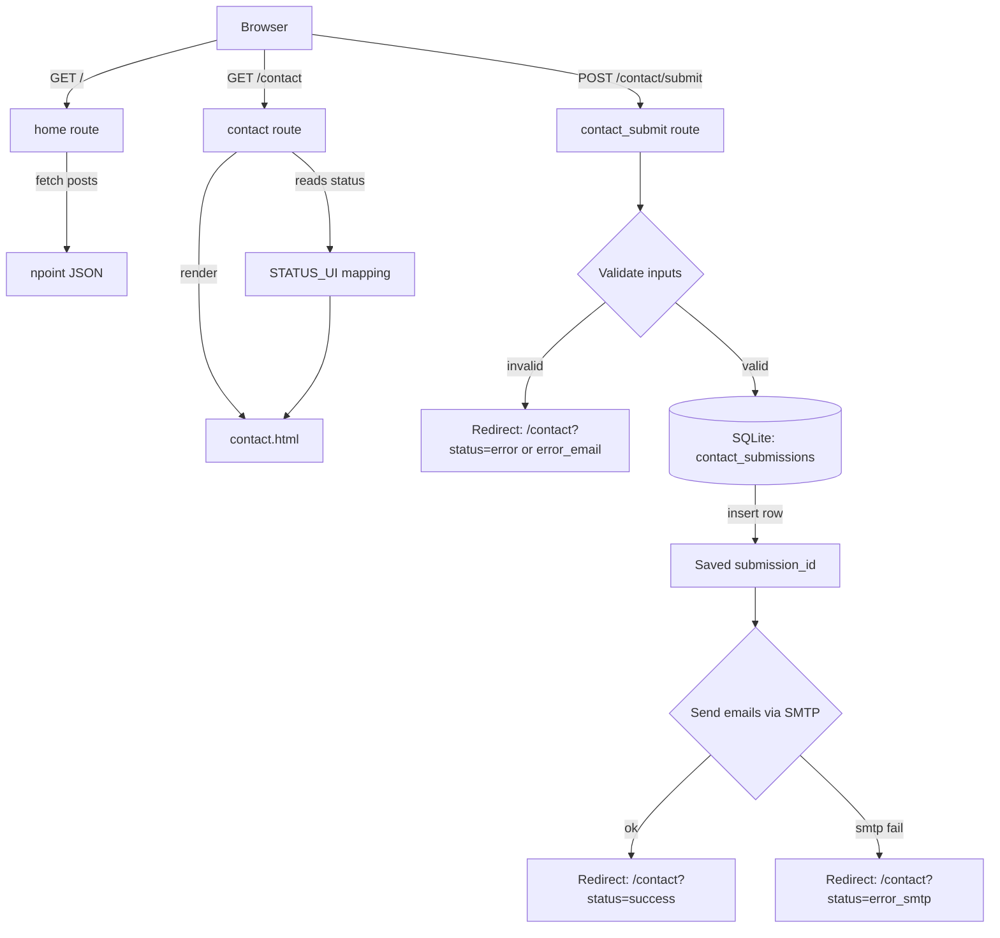

# Day 60 — Bootstrap + Flask POST Form <!-- omit in toc -->

[](../day_60/main.py)

| **Scope** | **Description**                                                                                                                                                                 |
| :-------: | :------------------------------------------------------------------------------------------------------------------------------------------------------------------------------ |
|   Goal    | Reuse the Day 59 Flask + Bootstrap blog and add HTML forms with POST handling to collect user input and respond dynamically.                                                    |
|   Steps   | Copy day_59 → day_60, add a form page in templates, create a route with GET/POST, read submitted data via request.form, validate basic inputs, render a success/error response. |
|   Stack   | Python, Flask, Jinja2, HTML forms, Bootstrap, HTTP GET/POST.                                                                                                                    |

## 📘 Table of contents <!-- omit in toc -->

- [🧠 Concepts Learned](#-concepts-learned)
- [⚠️ Challenges](#️-challenges)
- [✅ Solutions / Insights](#-solutions--insights)
- [📂 Project Structure](#-project-structure)
- [🏗 Architecture](#-architecture)
- [🎯 Next Steps](#-next-steps)

---

## 🧠 Concepts Learned

- **HTML Forms → Flask routes**: a form submits to a Flask endpoint via `action` + `method="POST"`.
- **PRG pattern** (Post → Redirect → Get): after processing a POST, redirect to a GET page with a `status` query param to avoid resubmits on refresh.
- **Reading form data** with `request.form.get("field_name")` (and why `name=""` on inputs is mandatory).
- **Client-side vs server-side validation**: browser/Bootstrap helps UX, but Flask validation is the “truth layer”.
- **Status-driven UI**: map `status` → `{title, message, alert_class}` and render a Bootstrap alert dynamically.
- **Type-checking reality**: `os.getenv()` returns `str | None` (Optional), so fail fast when secrets are missing.
- **SQLite basics**: creating tables (`CREATE TABLE IF NOT EXISTS`), altering schema (`ALTER TABLE ... ADD COLUMN`), and persisting data with `INSERT` + `commit()`.
- **DB design mindset**: store the submission first, then do side effects (email) so you don’t lose data when SMTP fails.
- **Tooling nuance**: `python` vs `python3` vs **uv** environments (`uv run ...`) and why imports fail when you run the wrong interpreter.

## ⚠️ Challenges

- Understanding why the template form worked without `action/method` at first, and when you actually need them.
- Confusion around missing `name=""` attributes (server receives nothing without them).
- Handling Optional values (`None`) from environment variables and type-checker warnings (Pylance/Pylint).
- Running commands in the correct Python environment (system python vs uv-managed env).
- Evolving the SQLite schema (adding `ip`, `user_agent`) and verifying the changes are saved.

## ✅ Solutions / Insights

- Added a dedicated POST route, validated inputs in Flask, and used **redirect + status param** for clean UX.
- Built a **STATUS_UI** dictionary to centralize messages + Bootstrap classes.
- Fixed Optional env var warnings by adding **fail-fast checks** (clear error if secrets are missing).
- Created and inspected SQLite DB via terminal (`sqlite3`, `.schema`, `.mode box`, `.headers on`).
- Implemented `init_db()` (idempotent table creation) and `save_submission()` (INSERT + `lastrowid`), then wired DB save into `contact_submit()` with `try/except sqlite3.Error` → `error_db`.
- Verified DB updates by re-running SELECT queries and reopening the DB (commit makes changes persistent).

## 📂 Project Structure

```text
├── __pycache__
│   ├── config.cpython-313.pyc
│   ├── main.cpython-313.pyc
│   ├── main.cpython-314.pyc
│   └── posts.cpython-313.pyc
├── config.py
├── data
│   └── contact_submissions.db
├── main.py
├── posts.py
├── static
│   ├── assets
│   │   ├── favicon.ico
│   │   └── img
│   │       ├── about-bg.jpg
│   │       ├── contact-bg.jpg
│   │       ├── home-bg.jpg
│   │       ├── post-bg.jpg
│   │       └── post-sample-image.jpg
│   ├── css
│   │   └── styles.css
│   └── js
│       └── scripts.js
└── templates
    ├── about.html
    ├── base.html
    ├── contact.html
    ├── footer.html
    ├── head.html
    ├── index.html
    ├── nav.html
    └── post.html
```

## 🏗 Architecture



## 🎯 Next Steps

- Keep Day 60 stable and follow the course pace for Day 61 (no extra features).
- Optionally clean up: keep DB file gitignored, and document schema changes as simple .sql notes.
- Later: add one tiny automated test (happy path + one error status) to practice repeatable checks.

---

[](day_59.md) [](day_61.md)
