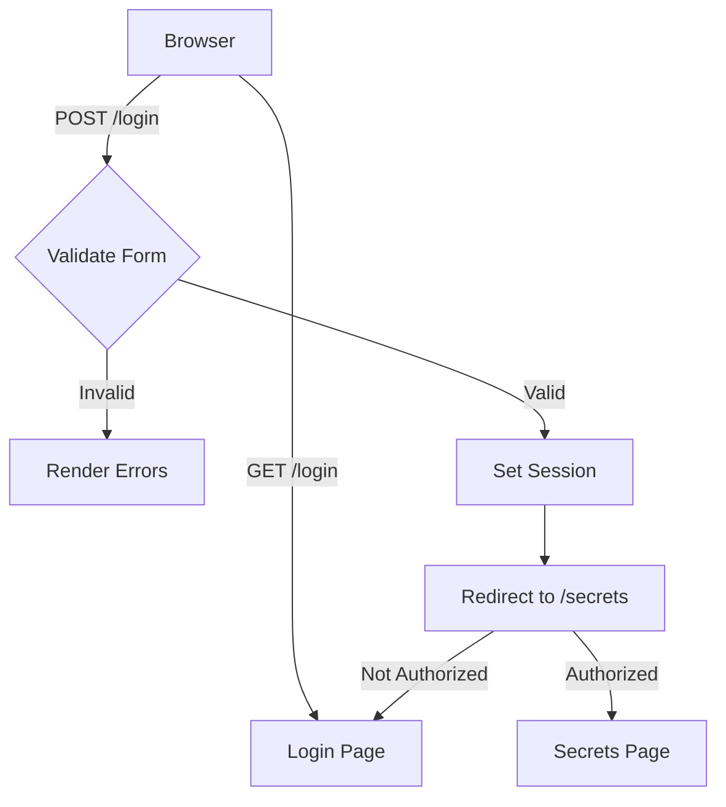

# Day 61 — Flask Validation & Login Gate <!-- omit in toc -->

[](../day_61/main.py)

| **Scope** | **Description**                                                                                                                                                 |
| :-------: | :-------------------------------------------------------------------------------------------------------------------------------------------------------------- |
|   Goal    | Build advanced Flask forms using Flask-WTF with validation + CSRF, and gate a “secrets” page behind login.                                                      |
|   Steps   | Install/configure Flask-WTF → create `LoginForm` with validators → render form in Jinja with CSRF token → validate on submit → allow/deny access to `/secrets`. |
|   Stack   | `Python`, `Flask`, `Flask-WTF` (WTForms), `Jinja2`, `HTML`/`CSS`.                                                                                               |

## 📘 Table of contents <!-- omit in toc -->

- [🧠 Concepts Learned](#-concepts-learned)
- [⚠️ Challenges](#️-challenges)
- [✅ Solutions / Insights](#-solutions--insights)
- [📂 Project Structure](#-project-structure)
- [🏗 Architecture](#-architecture)
- [🎯 Next Steps](#-next-steps)

---

## 🧠 Concepts Learned

- Difference between WTForms (form abstraction) and Flask-WTF (Flask integration + CSRF).
- Forms as Python classes that encapsulate fields, validation rules, state, and errors.
- Declarative validation using validators instead of manual `if` checks.
- Client-side (HTML5) vs server-side (Flask-WTF) validation and why both exist.
- CSRF protection via Flask secret key and `form.hidden_tag()`.
- Template inheritance in Jinja (`extends`, `block`) vs composition (`include`).
- Bootstrap-Flask as a rendering/styling layer, not a change in architecture.

## ⚠️ Challenges

- Confusion when reading Flask-WTF docs before understanding WTForms.
- Unexpected browser validation (Safari tooltips) blocking form submission.
- Understanding why blocks in included templates cannot be overridden.
- Balancing fast macros (`render_form`) with the need for styling control.

## ✅ Solutions / Insights

- Studied WTForms concepts first to clarify Flask-WTF’s role.
- Disabled HTML validation temporarily (`novalidate`) to observe server-side errors.
- Centralized overridable blocks (title, content, head extras) in base templates.
- Used Bootstrap-Flask macros initially, then identified styling extension points.
- Adopted a clear mental model: Forms define rules, routes define flow, sessions define state, templates define presentation.

## 📂 Project Structure

```text
day_61/
├── config.py
├── main.py
├── requirements.txt
├── tempCodeRunnerFile.py
└── templates
    ├── base.html
    ├── denied.html
    ├── index.html
    ├── login.html
    └── success.html
```

## 🏗 Architecture



## 🎯 Next Steps

- Proceed to Day 62 following the course.
- Revisit template layering and macros when the app grows.
- Later: introduce Flask-Login and password hashing for real authentication.

---

[](day_60.md) [](day_62.md)
