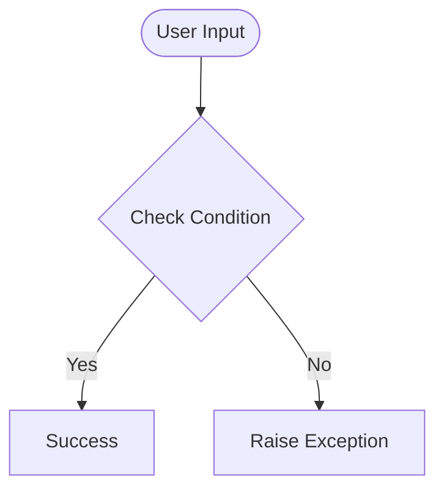

# Day 61 — Flask Validation & Login Gate <!-- omit in toc -->

[](../day_61/main.py)  

| **Scope** | **Description** |
|:---------:|:----------------|
|   Goal    | Build advanced Flask forms using Flask-WTF with validation + CSRF, and gate a “secrets” page behind login.          |
|   Steps   | Install/configure Flask-WTF → create `LoginForm` with validators → render form in Jinja with CSRF token → validate on submit → allow/deny access to `/secrets`.         |
|   Stack   | `Python`, `Flask`, `Flask-WTF` (WTForms), `Jinja2`, `HTML`/`CSS`.         |

## 📘 Table of contents <!-- omit in toc -->

- [🧠 Concepts Learned](#-concepts-learned)
- [⚠️ Challenges](#️-challenges)
- [✅ Solutions / Insights](#-solutions--insights)
- [📂 Project Structure](#-project-structure)
- [🏗 Architecture](#-architecture)
- [🎯 Next Steps](#-next-steps)

---

## 🧠 Concepts Learned

(Write bullet points here)

## ⚠️ Challenges

(What was confusing / hard)

## ✅ Solutions / Insights

(How you solved it / what finally clicked)

## 📂 Project Structure

```text
day_61/
├── main.py
├── config.py
```

## 🏗 Architecture



## 🎯 Next Steps

(Refactors, extra features, things to revisit)  

---
[](day_60.md) [](day_62.md)
