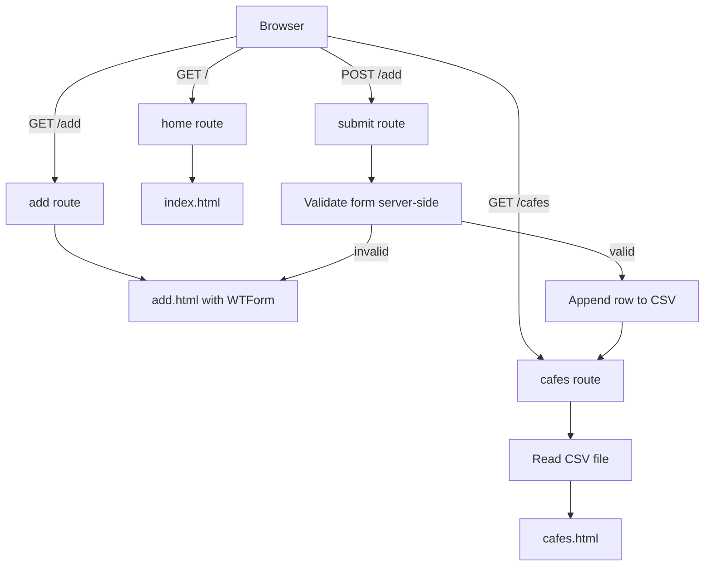

# Day 62 — Coffee & WiFi Project <!-- omit in toc -->

[](../day_62/main.py)

| **Scope** | **Description**                                                                                                                        |
| :-------: | :------------------------------------------------------------------------------------------------------------------------------------- |
|   Goal    | Build a Flask app that collects café data via validated web forms and stores it in a real database for reliable retrieval and display. |
|   Steps   | Set up DB model, render café list, add validated form flow, persist + query records.                                                   |
|   Stack   | `Python`, `Flask`, `Jinja2`, `Flask-WTF`/`WTForms`, `Bootstrap` (or `Bootstrap-Flask`), `SQLite`, `SQLAlchemy` (`Flask-SQLAlchemy`).   |

## 📘 Table of contents <!-- omit in toc -->

- [🧠 Concepts Learned](#-concepts-learned)
- [⚠️ Challenges](#️-challenges)
- [✅ Solutions / Insights](#-solutions--insights)
- [📂 Project Structure](#-project-structure)
- [🏗 Architecture](#-architecture)
- [🎯 Next Steps](#-next-steps)

---

## 🧠 Concepts Learned

- **Template inheritance**: `base.html` as the shared layout, child templates extend it.
- **Bootstrap-Flask mental model**: load Bootstrap CSS/JS once in the base template, then reuse components everywhere.
- **WTForms validation**: server-side validation is the source of truth; browser validation can be disabled with `novalidate=True`.
- **URL validation**: use WTForms `URL()` validator to enforce proper location links.
- **CSV append correctness**: `newline=""` avoids blank lines on some platforms and keeps row writing consistent.
- **Separation of concerns**: store raw data in storage, render “pretty” output in templates (e.g., show “Maps Link” instead of the full URL).
- **Semantics + maintainability in tables**: using `<thead>` and `<tbody>` is clearer, more accessible, and easier to style than a flat loop of `<tr>`.

## ⚠️ Challenges

- Git history surgery: rewording older commit messages caused rebase conflicts and ref-lock issues.
- WTForms `.data` types and editor warnings: handling `.strip()` safely when `.data` can be `None` in static analysis.
- Rendering CSV header row: initial approach treated headers as normal data rows.
- Template bugs/ambiguity: locating where to place Jinja “set” logic and ensuring the table loops were correct.
- “Maps Link” requirement: detect URLs reliably and render anchor tags without breaking other cells.

## ✅ Solutions / Insights

- **Rebase reality check**: changing an older commit message rewrites history from that commit forward (hashes change), so pushing requires `--force-with-lease`.
- **Pragmatism beats perfection**: once the branch was stable, we stopped rewriting history for a cosmetic typo.
- **CSV writing best practice**: use `csv.writer` and `newline=""` to avoid formatting surprises.
- **Table refactor**: split header row from data rows using Jinja logic and render properly with `<thead>`/`<tbody>`.
- **Empty-state guard**: added a conditional around table rendering to prevent crashes when there’s no data.
- **Production hygiene in links**: `target="_blank"` + `rel="noopener noreferrer"` for safer external links.

## 📂 Project Structure

```text
day_62/
├── cafe-data.csv
├── config.py
├── main.py
├── requirements.txt
├── static
│   └── css
│       └── styles.css
└── templates
    ├── add.html
    ├── base.html
    ├── cafes.html
    └── index.html
```

## 🏗 Architecture



## 🎯 Next Steps

- Day 63: learn SQLite + SQLAlchemy properly (ORM + CRUD mental model).
- Upgrade path after Day 63: refactor cafés app from CSV to SQLite with typed ratings and clean querying.
- Optional hardening:
  - Normalize/validate time fields (open/close) more strictly.
  - Add basic error handling around file I/O (missing file, permission errors).
  - Add pagination/sorting in /cafes once DB-backed.

---

[](day_61.md) [](day_63.md)
