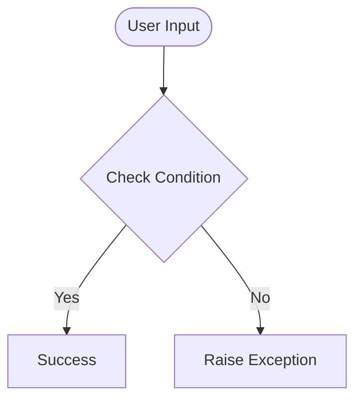

# Day 62 — Coffee & WiFi Project <!-- omit in toc -->

[](../day_62/main.py)  

| **Scope** | **Description** |
|:---------:|:----------------|
|   Goal    | Build a Flask app that collects café data via validated web forms and stores it in a real database for reliable retrieval and display.          |
|   Steps   | Set up DB model, render café list, add validated form flow, persist + query records.         |
|   Stack   | `Python`, `Flask`, `Jinja2`, `Flask-WTF`/`WTForms`, `Bootstrap` (or `Bootstrap-Flask`), `SQLite`, `SQLAlchemy` (`Flask-SQLAlchemy`).         |

## 📘 Table of contents <!-- omit in toc -->

- [🧠 Concepts Learned](#-concepts-learned)
- [⚠️ Challenges](#️-challenges)
- [✅ Solutions / Insights](#-solutions--insights)
- [📂 Project Structure](#-project-structure)
- [🏗 Architecture](#-architecture)
- [🎯 Next Steps](#-next-steps)

---

## 🧠 Concepts Learned

(Write bullet points here)

## ⚠️ Challenges

(What was confusing / hard)

## ✅ Solutions / Insights

(How you solved it / what finally clicked)

## 📂 Project Structure

```text
day_62/
├── main.py
├── config.py
```

## 🏗 Architecture



## 🎯 Next Steps

(Refactors, extra features, things to revisit)  

---
[](day_61.md) [](day_63.md)
