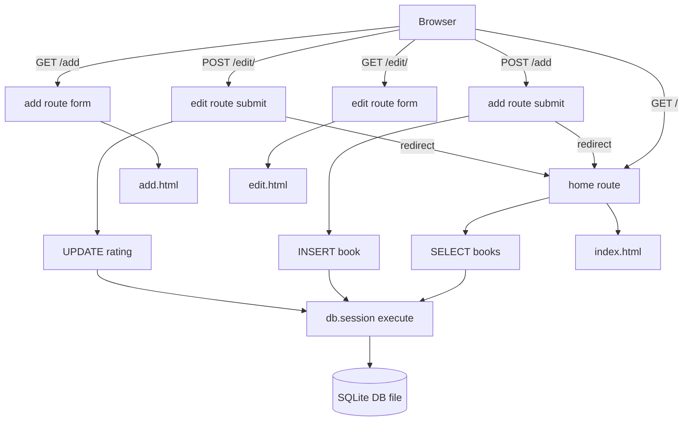

# Day 63 — Virtual Bookshelf with SQLite/SQLAlchemy <!-- omit in toc -->

[](../day_63/main.py)

| **Scope** | **Description**                                                                                                                      |
| :-------: | :----------------------------------------------------------------------------------------------------------------------------------- |
|   Goal    | Build a Flask app that stores and manages data in a SQLite database using SQLAlchemy (create, read, update, delete).                 |
|   Steps   | Set up Flask-SQLAlchemy + SQLite URI, define a model, create the DB, then build routes/forms to add, edit, delete, and list records. |
|   Stack   | `Python`, `Flask`, `Jinja2`, `SQLite`, `Flask-SQLAlchemy` (SQLAlchemy ORM)                                                           |

## 📘 Table of contents <!-- omit in toc -->

- [🧠 Concepts Learned](#-concepts-learned)
- [⚠️ Challenges](#️-challenges)
- [✅ Solutions / Insights](#-solutions--insights)
- [📂 Project Structure](#-project-structure)
- [🏗 Architecture](#-architecture)
- [🎯 Next Steps](#-next-steps)

---

## 🧠 Concepts Learned

- SQLite basics: tables, primary keys, UNIQUE + NOT NULL constraints.
- Flask-SQLAlchemy 3.x + SQLAlchemy 2.0 style models using `Mapped[...]` + `mapped_column(...)`.
- `app.app_context()` vs request context: why `db.create_all()` needs manual context outside routes.
- CRUD with ORM:
  - Create: `db.session.add()` + `db.session.commit()`
  - Read: `db.session.execute(db.select(...))` + `scalars().all()`
  - Update: load object → mutate attribute → `commit()`
- `db.get_or_404(Model, id)` for safe record fetching in web routes.
- CLI-first verification with `sqlite3` and quick port debugging with `lsof -i :5000`.

## ⚠️ Challenges

- Understanding Flask contexts: why DB operations fail without an app context outside requests.
- VS Code/Pylance warnings like “No parameter named 'title'” despite code running correctly.
- Getting `url_for()` right: endpoint name vs URL path.
- Remembering the difference between changing a Python object and persisting it with `commit()`.
- Local dev workflow issue: Safari tab not reacting after restarting the Flask server.

## ✅ Solutions / Insights

- Context “clicked”: routes run inside automatic app + request context; scripts need `with app.app_context():`.
- Confirmed IDE warnings were static type-check limitations by running the code and verifying DB contents in `sqlite3`.
- Fixed edit flow by:
  - using `db.get_or_404(Book, book_id)`
  - updating the loaded object in-memory
  - calling `db.session.commit()` before redirect
- Debugged the Safari non-reacting issue by checking/killing stale processes on port 5000 and hard-refreshing.

## 📂 Project Structure

```text
day_63/
├── config.py
├── instance
│   └── books-collection.db
├── main.py
├── sql_project
│   ├── books-collection.db
│   ├── instance
│   │   └── new-books-collection.db
│   └── main.py
└── templates
    ├── add.html
    ├── edit.html
    └── index.html
```

## 🏗 Architecture



## 🎯 Next Steps

- Implement `Delete` to complete CRUD (and prefer POST/confirm pattern later).
- Add minimal validation + error handling:
  - handle invalid `float(...)` rating input
  - handle duplicate titles (UNIQUE constraint) with user feedback
- Move from `db.create_all()` to migrations later (Alembic/Flask-Migrate) for real projects.
- Improve UX: flash messages for success/errors and form-level error messages.
- Optional: tune VS Code type-checking or use `# type: ignore[call-arg]` sparingly where ORM constructors are dynamic.

---

[](day_62.md) [](day_64.md)
