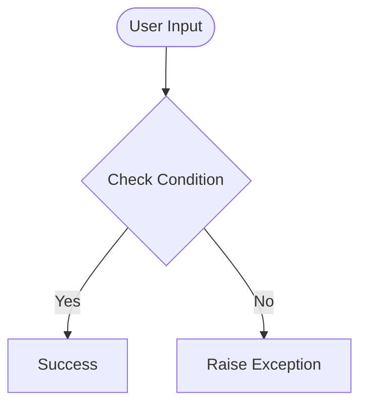

# Day 63 — Virtual Bookshelf with SQLite/SQLAlchemy <!-- omit in toc -->

[](../day_63/main.py)  

| **Scope** | **Description** |
|:---------:|:----------------|
|   Goal    | Build a Flask app that stores and manages data in a SQLite database using SQLAlchemy (create, read, update, delete).          |
|   Steps   | Set up Flask-SQLAlchemy + SQLite URI, define a model, create the DB, then build routes/forms to add, edit, delete, and list records.         |
|   Stack   | `Python`, `Flask`, `Jinja2`, `SQLite`, `Flask-SQLAlchemy` (SQLAlchemy ORM)         |

## 📘 Table of contents <!-- omit in toc -->

- [🧠 Concepts Learned](#-concepts-learned)
- [⚠️ Challenges](#️-challenges)
- [✅ Solutions / Insights](#-solutions--insights)
- [📂 Project Structure](#-project-structure)
- [🏗 Architecture](#-architecture)
- [🎯 Next Steps](#-next-steps)

---

## 🧠 Concepts Learned

(Write bullet points here)

## ⚠️ Challenges

(What was confusing / hard)

## ✅ Solutions / Insights

(How you solved it / what finally clicked)

## 📂 Project Structure

```text
day_63/
├── main.py
├── config.py
```

## 🏗 Architecture



## 🎯 Next Steps

(Refactors, extra features, things to revisit)  

---
[](day_62.md) [](day_64.md)
