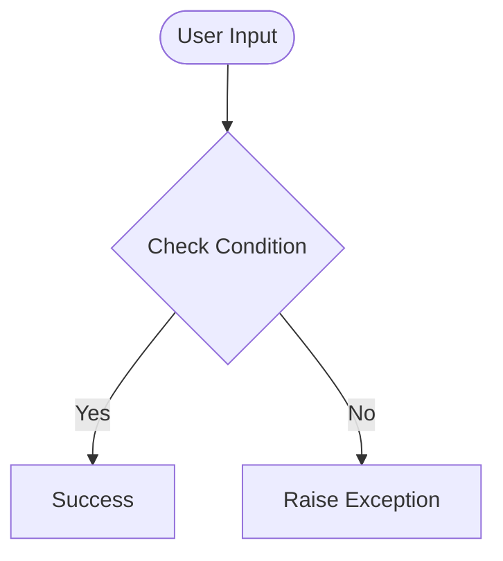

# Day 64 — Top 10 Movies <!-- omit in toc -->

[](../day_64/main.py)  

| **Scope** | **Description** |
|:---------:|:----------------|
|   Goal    | Build a “Top 10 Movies” Flask website where you can add movies, store them in SQLite via SQLAlchemy, and edit/update entries through WTForms.          |
|   Steps   | Build a Flask “Top 10 Movies” app by defining a Movie model in SQLite/SQLAlchemy, rendering a ranked list, and adding WTForms flows to add movies (via search/select) and edit ratings/reviews with commits and redirects.         |
|   Stack   | `Python`, `Flask`, `Jinja2` templates, `WTForms`/`Flask-WTF`, `SQLite`, `SQLAlchemy` (`Flask-SQLAlchemy`).         |

## 📘 Table of contents <!-- omit in toc -->

- [🧠 Concepts Learned](#-concepts-learned)
- [⚠️ Challenges](#️-challenges)
- [✅ Solutions / Insights](#-solutions--insights)
- [📂 Project Structure](#-project-structure)
- [🏗 Architecture](#-architecture)
- [🎯 Next Steps](#-next-steps)

---

## 🧠 Concepts Learned

(Write bullet points here)

## ⚠️ Challenges

(What was confusing / hard)

## ✅ Solutions / Insights

(How you solved it / what finally clicked)

## 📂 Project Structure

```text
day_64/
├── main.py
├── config.py
```

## 🏗 Architecture



## 🎯 Next Steps

(Refactors, extra features, things to revisit)  

---
[](day_63.md) [](day_65.md)
