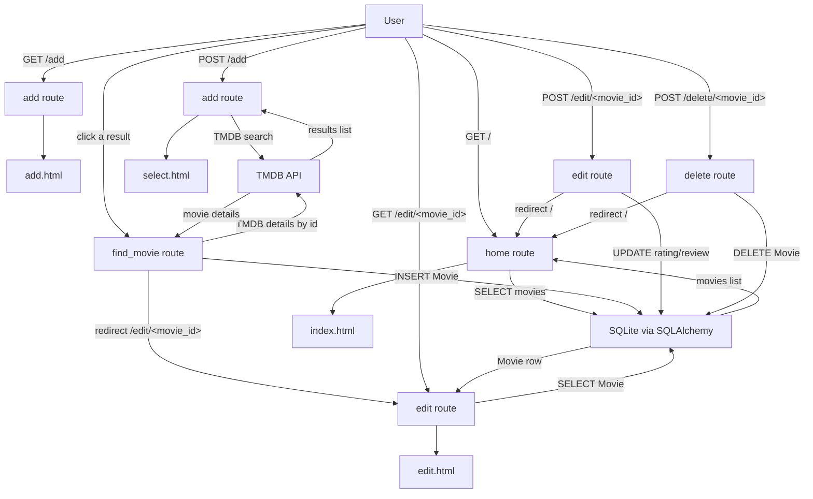

# Day 64 — Top 10 Movies <!-- omit in toc -->

[](../day_64/main.py)

| **Scope** | **Description**                                                                                                                                                                                                            |
| :-------: | :------------------------------------------------------------------------------------------------------------------------------------------------------------------------------------------------------------------------- |
|   Goal    | Build a “Top 10 Movies” Flask website where you can add movies, store them in SQLite via SQLAlchemy, and edit/update entries through WTForms.                                                                              |
|   Steps   | Build a Flask “Top 10 Movies” app by defining a Movie model in SQLite/SQLAlchemy, rendering a ranked list, and adding WTForms flows to add movies (via search/select) and edit ratings/reviews with commits and redirects. |
|   Stack   | `Python`, `Flask`, `Jinja2` templates, `WTForms`/`Flask-WTF`, `SQLite`, `SQLAlchemy` (`Flask-SQLAlchemy`).                                                                                                                 |

## 📘 Table of contents <!-- omit in toc -->

- [🧠 Concepts Learned](#-concepts-learned)
- [⚠️ Challenges](#️-challenges)
- [✅ Solutions / Insights](#-solutions--insights)
- [📂 Project Structure](#-project-structure)
- [🏗 Architecture](#-architecture)
- [🎯 Next Steps](#-next-steps)

---

## 🧠 Concepts Learned

- **Flask route design**: using **path params** (e.g., `/find/<int:tmdb_id>`) vs query params (`/find?id=...`) and why path params usually feel cleaner for “resource selection”.
- **SQLAlchemy session lifecycle**: objects start “transient” → `session.add()` makes them “pending” → `flush/commit` inserts to DB and hydrates generated fields (like `id`).
- **`flush()` vs `commit()`**: `flush()` sends SQL and assigns PKs without finalizing; `rollback()` reverts transaction and resets ORM identity state (saw IDs go `None -> 1,2 -> None`).
- **Result handling** with `execute(select(...))`: when you get `Result` you often want `.scalars()` to unwrap ORM rows into model instances.
- **DB schema realities**: changing `nullable=True` in models does **not** update existing DB tables; `create_all()` won’t alter tables → you need migrations later (or reset dev DB now).
- **Data normalization** before DB write: TMDB `release_date` is `"YYYY-MM-DD"` string; DB expects `int` year → parse safely with `[:4]` + `int(...)` and fallback to `None`.
- **Defensive string handling**: form fields can be `None` → always normalize before `.strip()` using `(value or "")`.
- **Computed ranking**: ranking is a *view concern*; compute rank from sorted ratings rather than storing `ranking` and constantly syncing it.
- **Sorting with NULL rules**: push unrated movies to bottom using `order_by(Movie.rating.is_(None), Movie.rating.desc())`.
- **Bootstrap UX patterns**: “selectable rows” (horizontal cards) + `stretched-link` + hover/focus polish create fintech-style selection lists without JS frameworks.
- **CSS scoping discipline**: avoid global overrides of framework classes like `.card` (it breaks unrelated pages). Use specific custom classes like `.flip-card` / `.select-row`.
- **Tooling muscle**: VS Code + Pylance/Pylint forcing strictness improves learning because you must resolve `None` paths, bad imports, and type friction consciously.

## ⚠️ Challenges

- **Import confusion / “unused import” noise** when models live in separate files; understanding when an import is required for side effects (model registration) vs just for usage.
- **Running scripts as modules** (`python -m ...`) and how that changes import resolution; differences between running a file vs running a module.
- **TMDB auth gotcha**: temporary 401 “Invalid API key” + the reality that external services can behave inconsistently (timing, propagation, config mistakes).
- **Poster URL confusion**: TMDB returns `poster_path` (partial path), not a full image URL; needed a helper to build the final URL consistently.
- **Mismatched field names**: `img_url` vs `image_url` (and other “one word mismatch” bugs) causing silent template issues or runtime `TypeError`.
- **Integrity errors**: `NOT NULL constraint failed` revealed DB schema was older than model definitions; learned that “model code” != “DB reality”.
- **Type/value mismatch**: year being a string caused SQLAlchemy errors; required explicit parsing + validation.
- **Ranking logic confusion**: computed ranking initially “reversed” because the query sorted ascending; learned that “rank = list position” depends entirely on sort order.
- **UI layout bugs**: cards not stretching full width due to global `.card { width: ... }` rules; DevTools confirmed the constraint.
- **Overflow / readability**: overview text and card layout needed refinement (line clamp, smaller font, aligning content, stretching to match poster height).
- **Static analysis friction**: Pylance complains about SQLAlchemy model constructors; understanding when to refactor vs when to ignore in a controlled tutorial scope.

## ✅ Solutions / Insights

- **Best practice: scope CSS**. Renamed flip-card styling to a custom class (e.g., `.flip-card`) instead of overriding `.card` globally; Bootstrap cards then behaved as expected.
- **Computed ranking approach**. Removed the need to persist ranking (or constantly recompute it on every home page view) by sorting by rating and using list position as rank.
- **Correct ranking order**. Used `order_by(Movie.rating.is_(None), Movie.rating.desc())` so unrated (NULL) movies go last and highest rating becomes rank #1.
- **Safe parsing for year**. Parse `release_date` to `year` with a try/except; store `None` if missing or invalid rather than crashing on insert.
- **Defensive form handling**. Normalize form string fields before `.strip()` and treat optional fields as empty strings to avoid `NoneType` errors.
- **Stable insert flow**. On `find_movie`, create the Movie row with safe defaults (e.g., `rating=0.0`, `review=""`) so inserts don’t violate constraints.
- **Correct redirect after insert**. After `commit()`, use `movie_data.id` (DB-generated) for redirect to `/edit/<movie_id>`.
- **Debugging discipline**. Read SQLAlchemy tracebacks by mapping column lists to parameter values; identify the first constraint that fails (e.g., `movies.rating`).
- **Smoke testing mindset**. Added standalone scripts to exercise database/API logic without touching `main.py`, enabling faster iteration and safer refactors.
- **Template ergonomics**. Built a “select list” page with horizontal row cards + `stretched-link` for full-row selection; used badges and overview clamp to avoid selecting wrong movie versions.

## 📂 Project Structure

```text
day_64/
├── config.py
├── extensions.py
├── forms.py
├── instance
│   └── movies_dev.db
├── main.py
├── models.py
├── movie_search.py
├── requirements.txt
├── scripts
│   ├── __pycache__
│   │   ├── smoke_db.cpython-313.pyc
│   │   ├── smoke_db.cpython-314.pyc
│   │   └── smoke_tmdb.cpython-313.pyc
│   ├── smoke_db.py
│   └── smoke_tmdb.py
├── static
│   └── css
│       └── styles.css
├── templates
│   ├── add.html
│   ├── base.html
│   ├── edit.html
│   ├── index.html
│   └── select.html
└── tests
    └── test_db.py
```

## 🏗 Architecture



## 🎯 Next Steps

- Add basic **user-friendly error handling** for TMDB failures (401/429/timeout) and show a clean message instead of a stack trace.
- Decide a consistent **rating policy** for new movies (keep 0.0 vs nullable) and make home ordering match that intent.
- Refactor TMDB integration into a small service layer (`movie_search.py`) with a clean return type (response metadata + parsed results).
- Add **form UX polish**: pre-fill rating/review on edit, add helper text and constraints (min/max rating).
- Add a minimal **test plan**: smoke tests for TMDB + DB insert; a small unit test for year parsing and “NULL last” ordering.
- (Later) introduce **migrations** (Flask-Migrate/Alembic) so schema changes don’t require deleting the dev DB.
- Add basic **logging** (later: logging module) so debug prints become structured and controllable.
- Consider replacing any remaining “global CSS” with scoped classes to avoid future Bootstrap collisions.
- Optional: show ranking directly via Jinja (`loop.index`) to fully remove any `movies_ranked = [...]` duplication.
- Keep practicing “production mindset in small chunks”: isolate services, avoid writes on `GET`, and keep side effects explicit.

---

[](day_63.md) [](day_65.md)
