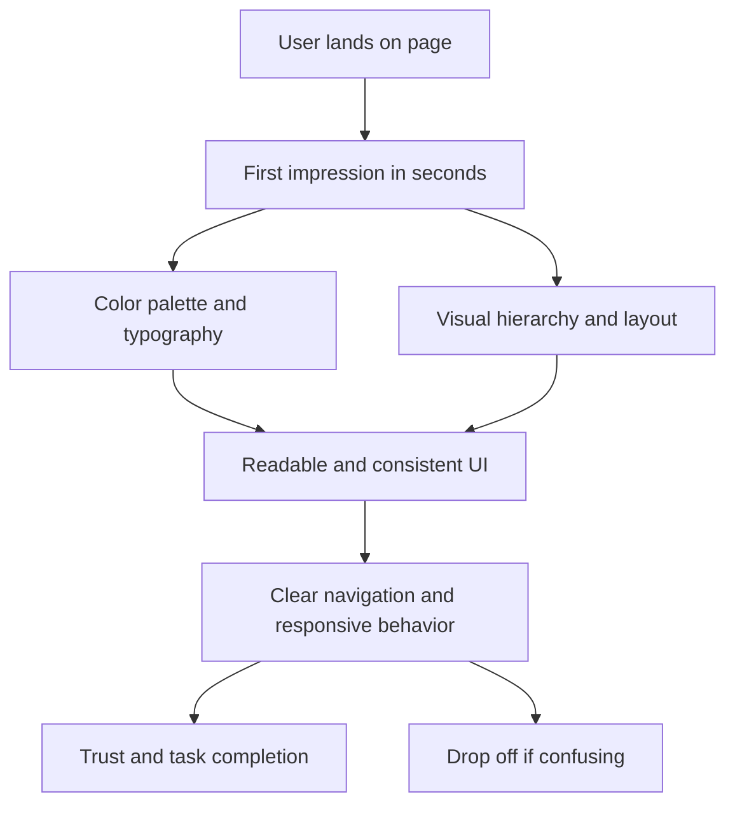

# Day 65 — Web Design Principles <!-- omit in toc -->

[](../day_65/main.py)

| **Scope** | **Description**                                                                                                                                                                                               |
| :-------: | :------------------------------------------------------------------------------------------------------------------------------------------------------------------------------------------------------------ |
|   Goal    | Learn the core principles of web design so your websites don’t just work, but look beautiful and feel premium. Understand how design shapes first impressions and perceived value within seconds.             |
|   Steps   | Study the 4 pillars of good web design: Color Theory, Typography, UI Design, and UX Design. Apply these principles to evaluate “bad vs redesigned” examples and start improving your own pages intentionally. |
|   Stack   | Web design fundamentals, HTML/CSS (as the medium), visual design principles (color, type), UI patterns, UX thinking.                                                                                          |

## 📘 Table of contents <!-- omit in toc -->

- [🧠 Concepts Learned](#-concepts-learned)
- [⚠️ Challenges](#️-challenges)
- [✅ Solutions / Insights](#-solutions--insights)
- [📂 Project Structure](#-project-structure)
- [🏗 Architecture](#-architecture)
- [🎯 Next Steps](#-next-steps)

---

## 🧠 Concepts Learned

- **Design drives perceived value**: users judge a website in the first seconds, and visuals heavily influence trust and pricing expectations.
- **Color theory**: colors carry emotional/brand meaning; use a consistent palette and leverage contrast/complementary colors intentionally (not everywhere).
- **Typography**: prioritize readability and purpose; use **1–2 fonts max** and keep a clear heading vs body text system.
- **Visual hierarchy**: guide attention with size, weight, contrast, and accent color so the user knows what matters most.
- **Layout fundamentals**: alignment, constrained text width, and whitespace create clarity and make key elements stand out.
- **UX principles**: organize content into scannable groups, keep patterns consistent across pages, and design responsively for wide screens and mobile.
- **Dark patterns**: avoid manipulative UI tricks (hidden opt-outs, misleading buttons/colors) because they damage trust.

## ⚠️ Challenges

- Translating design theory into concrete rules without a hands-on project.
- Knowing how much contrast/accent is “enough” without making the page noisy.
- Choosing font pairings that look good **and** stay readable, especially on mobile.

## ✅ Solutions / Insights

- Use constraints as guardrails: **1 primary + 1 accent + neutrals**, and **max 2 fonts**.
- Build hierarchy on purpose: one primary action per screen, with whitespace and muted secondary elements.
- Design for scanning: group related content, align consistently, and keep text lines reasonably short for readability.
- Treat responsiveness as part of UX, not an afterthought: check layout at mobile width early.

## 📂 Project Structure

```text
day_65/
├── main.py
├── config.py
```

## 🏗 Architecture



## 🎯 Next Steps

- Pick one Daily UI challenge and implement it as a single responsive HTML/CSS page.
- Apply the same palette + typography + spacing rules to one of your earlier Flask templates and compare before/after.

---

[](day_64.md) [](day_66.md)
