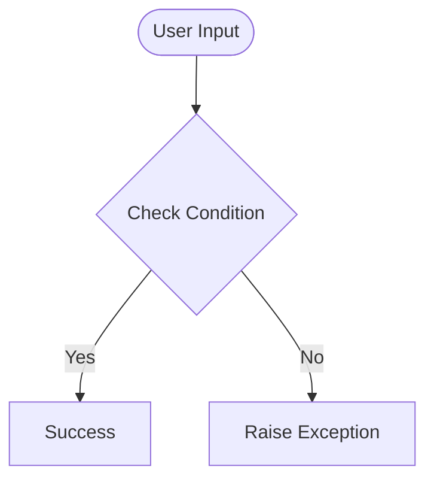

# Day 65 — Web Design Principles <!-- omit in toc -->

[](../day_65/main.py)  

| **Scope** | **Description** |
|:---------:|:----------------|
|   Goal    | Learn the core principles of web design so your websites don’t just work, but look beautiful and feel premium. Understand how design shapes first impressions and perceived value within seconds.          |
|   Steps   | Study the 4 pillars of good web design: Color Theory, Typography, UI Design, and UX Design. Apply these principles to evaluate “bad vs redesigned” examples and start improving your own pages intentionally.         |
|   Stack   | Web design fundamentals, HTML/CSS (as the medium), visual design principles (color, type), UI patterns, UX thinking.         |

## 📘 Table of contents <!-- omit in toc -->

- [🧠 Concepts Learned](#-concepts-learned)
- [⚠️ Challenges](#️-challenges)
- [✅ Solutions / Insights](#-solutions--insights)
- [📂 Project Structure](#-project-structure)
- [🏗 Architecture](#-architecture)
- [🎯 Next Steps](#-next-steps)

---

## 🧠 Concepts Learned

(Write bullet points here)

## ⚠️ Challenges

(What was confusing / hard)

## ✅ Solutions / Insights

(How you solved it / what finally clicked)

## 📂 Project Structure

```text
day_65/
├── main.py
├── config.py
```

## 🏗 Architecture



## 🎯 Next Steps

(Refactors, extra features, things to revisit)  

---
[](day_64.md) [](day_66.md)
