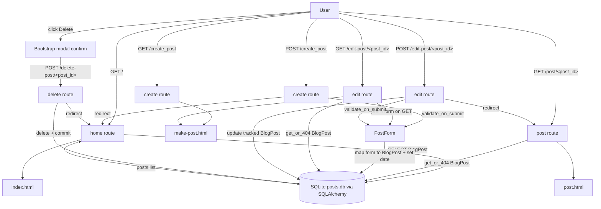

# Day 67 — Blog with RESTful editing <!-- omit in toc -->

[](../day_67/main.py)

| **Scope** | **Description**                                                                                                           |
| :-------: | :------------------------------------------------------------------------------------------------------------------------ |
|   Goal    | Build a blog that reads posts from `posts.db` via Flask-SQLAlchemy and supports viewing + editing posts.                  |
|   Steps   | 1) Set up starter files. 2) Connect to `posts.db` with SQLAlchemy. 3) Build list + post pages. 4) Add create/edit/delete. |
|   Stack   | Python, Flask, Jinja2, SQLite, Flask-SQLAlchemy, Flask-WTF, CKEditor, Bootstrap.                                          |

## 📘 Table of contents <!-- omit in toc -->

- [🧠 Concepts Learned](#-concepts-learned)
- [⚠️ Challenges](#️-challenges)
- [✅ Solutions / Insights](#-solutions--insights)
- [📂 Project Structure](#-project-structure)
- [🏗 Architecture](#-architecture)
- [🎯 Next Steps](#-next-steps)

---

## 🧠 Concepts Learned

- **GET vs POST mental model**: GET renders the page &#40;optionally prefilled&#41;; POST processes submitted data, commits changes, then redirects.
- **Flask-WTF + WTForms**: form classes define fields + validators; `validate_on_submit()` gates the DB write path.
- **SQLAlchemy session tracking**: objects loaded from the DB are already tracked, so edits require only attribute updates + `commit()` &#40;no `add()` needed&#41;.
- **Generic form-to-model mapping**: iterating over model columns can reduce boilerplate, but you must skip server-managed fields like `id` and `date`.
- **Routing patterns**: path params like `/post/<int:post_id>` bind directly to function args; query params require `request.args.get()`.
- **UI confirmations done right**: delete should be a POST action, and a Bootstrap modal can confirm intent without relying on browser `confirm()`.
- **`url_for()` everywhere**: generate URLs in templates &#40;and even in JS as a base&#41; so route changes don’t break links.

## ⚠️ Challenges

- Confused when to use **function args** vs `request.args.get()` for IDs and routing.
- Accidentally overwrote submitted edits by **prefilling the form on POST** in the edit route.
- Delete action initially used an `<a>` link &#40;GET&#41; instead of a safe POST request.
- Styling looked “Times New Roman” because the theme uses a serif body font; needed to rely on Bootstrap classes / theme structure.
- Wiring the delete modal required aligning **route path** + **JS form action** reliably.

## ✅ Solutions / Insights

- Prefill forms **only on GET**; on **POST** keep user input, validate, commit, and redirect.
- Use `field.name` for WTForms field keys; skip `csrf_token` and `submit` when looping.
- For deletes: use a **POST form** and a **Bootstrap modal** confirmation; keep server route `POST /delete-post/<id>`.
- Use a `url_for('delete_post', post_id=0)` base inside the template to avoid hard-coded paths in JS.
- Keep templates consistent with the theme: `header.html` / `footer.html` includes and Bootstrap utility classes for alignment.

## 📂 Project Structure

```text
day_67/
├── config.py
├── instance
│   └── posts.db
├── main.py
├── requirements.txt
├── static
│   ├── assets
│   │   ├── favicon.ico
│   │   └── img
│   │       ├── about-bg.jpg
│   │       ├── contact-bg.jpg
│   │       ├── edit-bg.jpg
│   │       ├── home-bg.jpg
│   │       └── post-bg.jpg
│   ├── css
│   │   └── styles.css
│   └── js
│       └── scripts.js
└── templates
    ├── about.html
    ├── contact.html
    ├── footer.html
    ├── header.html
    ├── index.html
    ├── make-post.html
    └── post.html
```

## 🏗 Architecture



## 🎯 Next Steps

- Add **CSRF protection** to delete via a form token strategy that works with the modal.
- Handle **unique title** conflicts gracefully &#40;catch IntegrityError and show a friendly message&#41;.
- Extract common “form-to-model” logic into a helper to reduce duplication between create/edit.
- Add flash messages for create/edit/delete success.

---

[](day_66.md) [](day_68.md)
