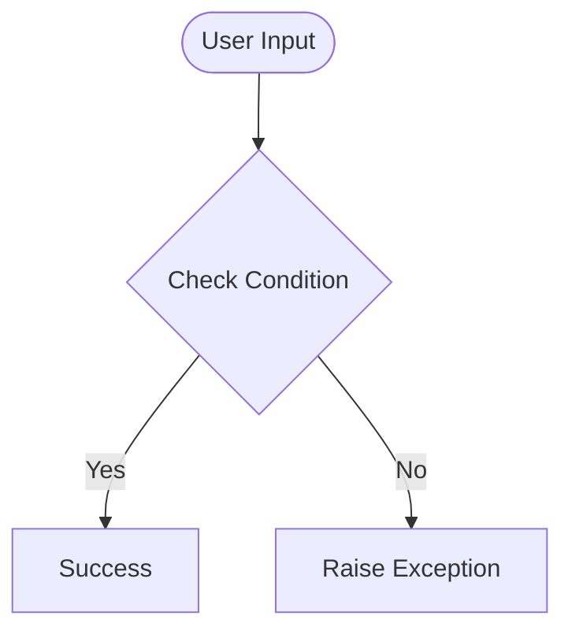

# Day 67 — Blog with RESTful editing <!-- omit in toc -->

[](../day_67/main.py)

| **Scope** | **Description**                                                                                                           |
| :-------: | :------------------------------------------------------------------------------------------------------------------------ |
|   Goal    | Build a blog that reads posts from `posts.db` via Flask-SQLAlchemy and supports viewing + editing posts.                  |
|   Steps   | 1) Set up starter files. 2) Connect to `posts.db` with SQLAlchemy. 3) Build list + post pages. 4) Add create/edit/delete. |
|   Stack   | Python, Flask, Jinja2, SQLite, Flask-SQLAlchemy, Flask-WTF, CKEditor, Bootstrap.                                          |

## 📘 Table of contents <!-- omit in toc -->

- [🧠 Concepts Learned](#-concepts-learned)
- [⚠️ Challenges](#️-challenges)
- [✅ Solutions / Insights](#-solutions--insights)
- [📂 Project Structure](#-project-structure)
- [🏗 Architecture](#-architecture)
- [🎯 Next Steps](#-next-steps)

---

## 🧠 Concepts Learned

(Write bullet points here)

## ⚠️ Challenges

(What was confusing / hard)

## ✅ Solutions / Insights

(How you solved it / what finally clicked)

## 📂 Project Structure

```text
day_67/
├── main.py
├── config.py
```

## 🏗 Architecture



## 🎯 Next Steps

(Refactors, extra features, things to revisit)

---

[](day_66.md) [](day_68.md)
