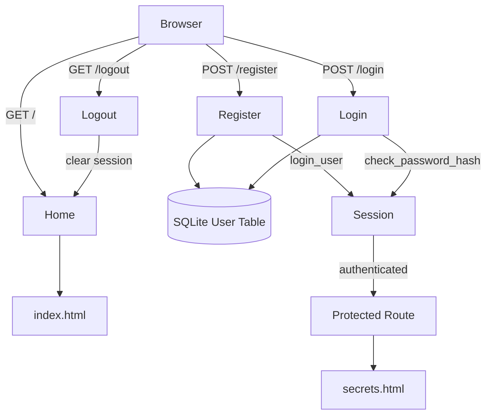

# Day 68 — Authentication with Flask <!-- omit in toc -->

[](../day_68/main.py)

| **Scope** | **Description**                                                                                                                                                                                                                                                                   |
| :-------: | :-------------------------------------------------------------------------------------------------------------------------------------------------------------------------------------------------------------------------------------------------------------------------------- |
|   Goal    | Build secure authentication in Flask so users can register, log in and out, and access a protected “top-secret” download only when authenticated.                                                                                                                                 |
|   Steps   | Define a User model and database table, implement registration with email uniqueness checks and password hashing, implement login with hash verification and session handling, add logout to clear the session, and protect the secret page/download route behind authentication. |
|   Stack   | Python, Flask, Flask-Login, Flask-SQLAlchemy (SQLite), Werkzeug Security (password hashing), Jinja2 templates, HTML/CSS (Bootstrap optional).                                                                                                                                     |

## 📘 Table of contents <!-- omit in toc -->

- [🧠 Concepts Learned](#-concepts-learned)
- [⚠️ Challenges](#️-challenges)
- [✅ Solutions / Insights](#-solutions--insights)
- [📂 Project Structure](#-project-structure)
- [🏗 Architecture](#-architecture)
- [🎯 Next Steps](#-next-steps)

---

## 🧠 Concepts Learned

- How Flask-Login manages user sessions via `current_user` and decorators like `@login_required`.
- Designing a `User` model with SQLAlchemy and enforcing email uniqueness.
- Secure password storage using Werkzeug hashing (never storing raw passwords).
- Login flow: querying users, verifying hashes, and creating authenticated sessions.
- Logout mechanics and session cleanup.
- Conditional rendering in Jinja2 based on authentication state.
- Protecting routes and downloads behind authentication gates.

## ⚠️ Challenges

- Understanding how `current_user` propagates through templates.
- Handling duplicate registrations cleanly.
- Connecting Flask-Login with SQLAlchemy models.
- Reasoning about redirect flow after login/register.
- Debugging session-related issues when things “worked” but UI didn’t update.

## ✅ Solutions / Insights

- Passing `current_user.is_authenticated` directly into templates simplified UI logic.
- Treating auth as a full flow (register → login → protected route → logout) instead of isolated features.
- Explicit testing of each path (new user, existing user, wrong password).
- Realizing that authentication is mostly about state management, not just forms.
- Adopting a production mindset: verify behavior manually, not just “no errors.”

## 📂 Project Structure

```text
day_68/
├── config.py
├── instance
│   └── users.db
├── main.py
├── requirements.txt
├── static
│   ├── css
│   │   └── styles.css
│   └── files
│       └── cheat_sheet.pdf
└── templates
    ├── base.html
    ├── index.html
    ├── login.html
    ├── register.html
    └── secrets.html
```

## 🏗 Architecture



## 🎯 Next Steps

- Add form validation feedback per-field (not only flash messages).
- Introduce role-based access (admin vs user).
- Refactor auth logic into a dedicated module or blueprint.
- Add basic logging around login attempts.
- Prepare for OAuth or external providers in future projects.

---

[](day_67.md) [](day_69.md)
