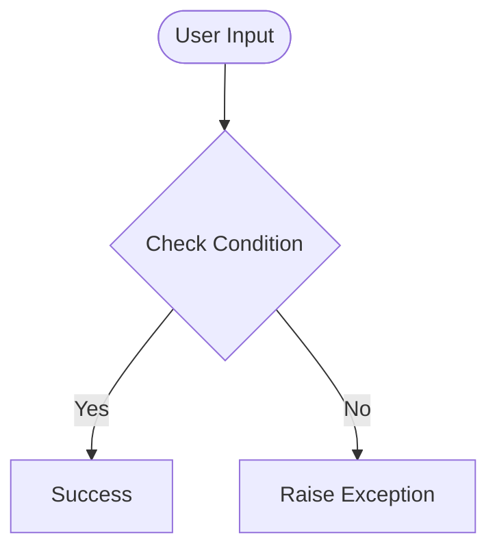

# Day 68 — Authentication with Flask <!-- omit in toc -->

[](../day_68/main.py)  

| **Scope** | **Description** |
|:---------:|:----------------|
|   Goal    | Build secure authentication in Flask so users can register, log in and out, and access a protected “top-secret” download only when authenticated.          |
|   Steps   | Define a User model and database table, implement registration with email uniqueness checks and password hashing, implement login with hash verification and session handling, add logout to clear the session, and protect the secret page/download route behind authentication.         |
|   Stack   | Python, Flask, Flask-Login, Flask-SQLAlchemy (SQLite), Werkzeug Security (password hashing), Jinja2 templates, HTML/CSS (Bootstrap optional).         |

## 📘 Table of contents <!-- omit in toc -->

- [🧠 Concepts Learned](#-concepts-learned)
- [⚠️ Challenges](#️-challenges)
- [✅ Solutions / Insights](#-solutions--insights)
- [📂 Project Structure](#-project-structure)
- [🏗 Architecture](#-architecture)
- [🎯 Next Steps](#-next-steps)

---

## 🧠 Concepts Learned

(Write bullet points here)

## ⚠️ Challenges

(What was confusing / hard)

## ✅ Solutions / Insights

(How you solved it / what finally clicked)

## 📂 Project Structure

```text
day_68/
├── main.py
├── config.py
```

## 🏗 Architecture



## 🎯 Next Steps

(Refactors, extra features, things to revisit)  

---
[](day_67.md) [](day_69.md)
