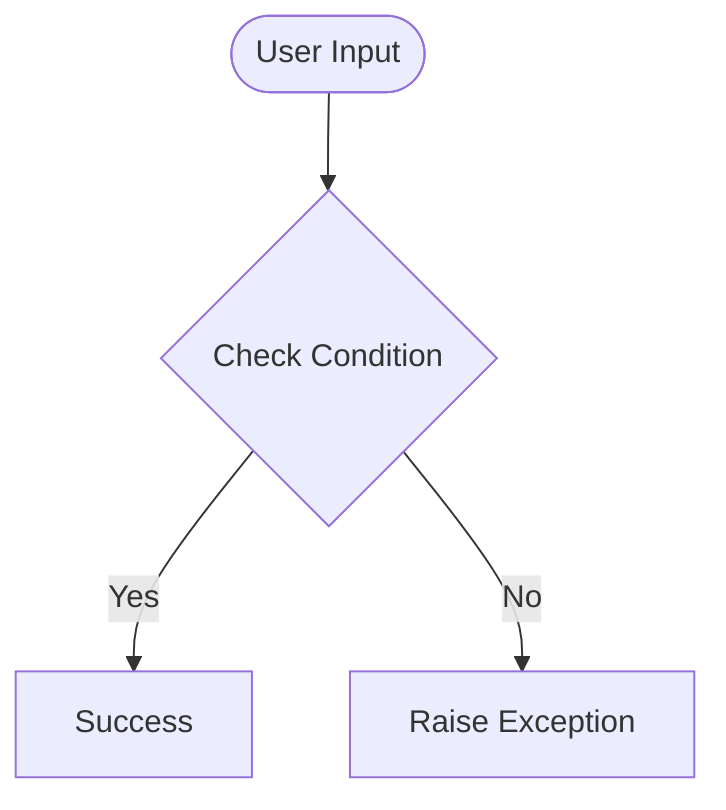

# Day 69 — Blog Authorization <!-- omit in toc -->

[](../day_69/main.py)  

| **Scope** | **Description** |
|:---------:|:----------------|
|   Goal    | Add user authentication and a comment system to the blog, with admin-only permissions for post management.          |
|   Steps   | Implement register/login/logout, protect routes with Flask-Login, add comments linked to users and posts, and restrict create/edit/delete to admin.         |
|   Stack   | Python, Flask, Flask-Login, Flask-WTF, SQLAlchemy, Werkzeug (password hashing), Jinja2, SQLite         |

## 📘 Table of contents <!-- omit in toc -->

- [🧠 Concepts Learned](#-concepts-learned)
- [⚠️ Challenges](#️-challenges)
- [✅ Solutions / Insights](#-solutions--insights)
- [📂 Project Structure](#-project-structure)
- [🏗 Architecture](#-architecture)
- [🎯 Next Steps](#-next-steps)

---

## 🧠 Concepts Learned

(Write bullet points here)

## ⚠️ Challenges

(What was confusing / hard)

## ✅ Solutions / Insights

(How you solved it / what finally clicked)

## 📂 Project Structure

```text
day_69/
├── main.py
├── config.py
```

## 🏗 Architecture



## 🎯 Next Steps

(Refactors, extra features, things to revisit)  

---
[](day_68.md) [](day_70.md)
