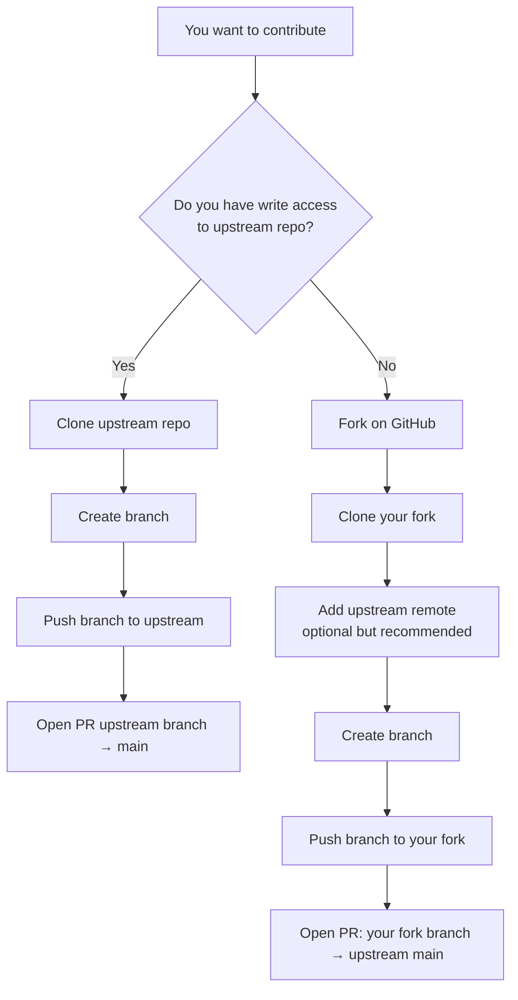

# Day 70 — Git, Github and Version Control <!-- omit in toc -->

[](../day_70/main.py)

| **Scope** | **Description**                                                                            |
| :-------: | :----------------------------------------------------------------------------------------- |
|   Goal    | Understand Git/GitHub version control enough to work confidently with branches and merges. |
|   Steps   | Branch → commit → push → merge → clean up + handle conflicts basics.                       |
|   Stack   | Git CLI, GitHub.                                                                           |

## 📘 Table of contents <!-- omit in toc -->

- [🧠 Concepts Learned](#-concepts-learned)
- [⚠️ Challenges](#️-challenges)
- [✅ Solutions / Insights](#-solutions--insights)
- [📂 Project Structure](#-project-structure)
- [🏗 Architecture](#-architecture)
- [🎯 Next Steps](#-next-steps)
- [🔗 Links Worth Remembering](#-links-worth-remembering)

---

## 🧠 Concepts Learned

- Version control fundamentals: commits are snapshots of history, not “save files”.
- Local vs remote: `main` (local) vs `origin/main` (remote tracking pointer to GitHub).
- Diffing changes:
  - `git diff` shows unstaged changes (working directory vs staging).
  - `git diff --cached` shows staged changes (staging vs last commit).
- Undo/rollback mental model:
  - `git restore file` discards local edits in working directory.
  - `git restore --staged file` unstages while keeping edits.
- `.gitignore` as repo hygiene: prevents committing secrets, venvs, caches, OS junk, DB files.
- Understanding “diverged branches” and how tools (GitLens) visualize ahead/behind counts.
- Collaboration workflows:
  - Download vs clone vs fork.
  - PRs require a writable remote: either you have upstream permission or you fork and PR from your fork.
- Branching & merging concepts (and what happens when changes collide, e.g., delete vs modify).
- Discovered high-quality resources:
  - GitHub’s official `.gitignore` templates repo.
  - “Awesome for beginners” open-source contribution list.
  - learngitbranching.js.org for visual Git practice.

## ⚠️ Challenges

- `git diff chapter3.txt` produced `fatal: ambiguous argument` (path vs revision confusion).
- Confusion when `git diff` returned no output (because working tree was clean / wrong file diffed).
- Understanding staged vs unstaged changes and which diff flag to use (`--cached`).
- Confusion about `git rm --cached -r .` vs “unstage” (untrack vs unstage).
- MacBook repo showed `diverged` from `origin/main` (large ahead/behind counts) and it wasn’t obvious what it meant.
- Clarifying the difference between clone/fork/download and why PRs are tied to permissions + writable remotes.
- Noticing Angela’s lesson skipped conflict details; needed real-world merge conflict intuition (delete vs modify).

## ✅ Solutions / Insights

- Fixed ambiguous diff by using the path separator and correct path context:
  - `git diff -- day_70/chapter3.txt`
  - Learned: `--` tells Git “everything after is a path”.
- Learned “no diff output” usually means “no changes” (or you diffed the wrong file):
  - Use `git status` + `git diff --name-only` to confirm what actually changed.
- Built the staged/unstaged mental model:
  - `git diff` (unstaged) → sanity check before staging.
  - `git diff --cached` (staged) → verify exactly what will be committed.
- Clarified undo flows:
  - Discard edits: `git restore file`
  - Unstage only: `git restore --staged file`
  - Unstage + discard: `git restore --staged file && git restore file`
- Understood GitLens value vs built-in VS Code Git:
  - VS Code Git = actions (stage/commit/push).
  - GitLens = visibility (graph, blame, history, ahead/behind, compare).
- Interpreted divergence correctly using GitLens:
  - “415 ↓ / 231 ↑” means remote has 415 commits I don’t, and local has 231 commits remote doesn’t.
- Understood contribution mechanics:
  - Clone is local; fork creates a GitHub remote I can push to; PR is made from a branch on GitHub.
- Captured key resources to reuse later:
  - github/gitignore templates, MunGell/awesome-for-beginners, learngitbranching.

## 📂 Project Structure

```text
day_70/
├── main.py
├── config.py
```

## 🏗 Architecture



## 🎯 Next Steps

- Practice Git via learngitbranching.js.org:
  - Focus on branching/merging and the Remote section (fetch/pull/push and tracking branches).
- Strengthen GitLens workflow:
  - Use Graph + Compare + File History routinely.
  - Toggle Line Blame when debugging “when did this change?” moments.
- Open-source micro-contribution goal:
  - Pick one “easy win” PR (broken link / small cleanup) from awesome-for-beginners to practice fork → branch → PR.
- Email system idea (future project seed):
  - Use MJML for email layout, but remember deliverability needs SPF/DKIM/DMARC + a sending provider.
  - Consider building a reusable “email engine” for multiple clients (friend + Zanchi + personal).

## 🔗 Links Worth Remembering

- GitHub .gitignore templates: https://github.com/github/gitignore
- Awesome for beginners: https://github.com/MunGell/awesome-for-beginners
- Learn Git Branching (interactive): https://learngitbranching.js.org/
- MJML (email templates): https://mjml.io/
- Foundation for Emails (legacy but still relevant): https://get.foundation/emails/

---

[](day_69.md) [](day_71.md)
