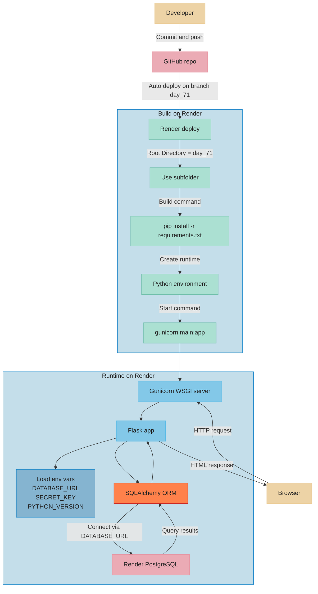

# Day 71 — Deploy your WebApp <!-- omit in toc -->

[](../day_71/main.py)

| **Scope** | **Description**                                                                    |
| :-------: | :--------------------------------------------------------------------------------- |
|   Goal    | Publish the Flask blog online (production deployment).                             |
|   Steps   | Push to GitHub → add Procfile/Gunicorn → deploy on Heroku → switch DB to Postgres. |
|   Stack   | Flask, Git/GitHub, Heroku, Gunicorn, PostgreSQL                                    |

## 📘 Table of contents <!-- omit in toc -->

- [🧠 Concepts Learned](#-concepts-learned)
- [⚠️ Challenges](#️-challenges)
- [✅ Solutions / Insights](#-solutions--insights)
- [📂 Project Structure](#-project-structure)
- [🏗 Architecture](#-architecture)
- [🎯 Next Steps](#-next-steps)

---

## 🧠 Concepts Learned

- Difference between development DB (SQLite) and production DB (PostgreSQL).
- How Gunicorn runs Flask apps in production instead of `app.run()`.
- How Render deploys from a specific Git branch.
- Importance of environment variables (`DATABASE_URL`) in production.
- How `db.create_all()` works (creates tables only if missing, does NOT migrate).
- Basic `psql` usage (`\dt`, `\d`, `SELECT`, `COUNT(*)`).
- Difference between SQLite CLI commands (`.tables`) and PostgreSQL meta-commands (`\dt`).
- Understanding free-tier limitations (cold starts, single instance, connection caps).
- Short-circuit behavior in Python conditionals (`user is None or ...`).

## ⚠️ Challenges

- Python 3.13 incompatibility with SQLAlchemy on Render.
- Understanding why model changes do not automatically update existing DB schema.
- Confusion between SQLite and PostgreSQL CLI commands.
- Setting up `psql` correctly on macOS (PATH configuration).
- Mental friction around infrastructure vs first paying client.
- Strategic confusion between engineering mastery and business validation.

## ✅ Solutions / Insights

- Downgraded Python to 3.12 for stable deployment.
- Installed PostgreSQL client via Homebrew and configured PATH safely.
- Connected to Render Postgres using external DB URL.
- Verified production tables directly with `psql`.
- Confirmed data integrity via manual SQL queries.
- Realized infrastructure is not the bottleneck for first revenue.
- Identified that clarity of objective (job vs SaaS vs mastery) matters more than infra optimization.

## 📂 Project Structure

```text
day_71/
├── config.py
├── forms.py
├── instance
│   └── blog.db
├── main.py
├── requirements.txt
├── static
│   ├── assets
│   │   ├── favicon.ico
│   │   └── img
│   │       ├── about-bg.jpg
│   │       ├── angela-profile.jpg
│   │       ├── contact-bg.jpg
│   │       ├── default-profile.jpg
│   │       ├── edit-bg.jpg
│   │       ├── home-bg.jpg
│   │       ├── login-bg.jpg
│   │       ├── post-bg.jpg
│   │       └── register-bg.jpg
│   ├── css
│   │   └── styles.css
│   └── js
│       └── scripts.js
└── templates
    ├── about.html
    ├── contact.html
    ├── footer.html
    ├── header.html
    ├── index.html
    ├── login.html
    ├── make-post.html
    ├── post.html
    └── register.htm
```

## 🏗 Architecture



## 🎯 Next Steps

- Refactor README generation to use YAML + Jinja (single source of truth).
- Update repository payoff to reflect “start from Angela + add production habits” mindset.
- Add role-based authorization instead of `id == 1` admin logic.
- Introduce real schema evolution later via migrations (Flask-Migrate/Alembic).
- Add Stripe Checkout proof-of-concept (payment link first, webhooks later).
- Decide 6-month priority: engineering depth vs revenue vs job positioning.

---

[](day_70.md) [](day_72.md)
